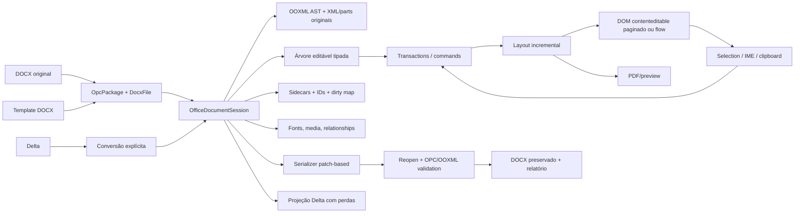

# Plano técnico — modo DOCX paginado avançado sem quebrar o Quill simples

**Data da auditoria:** 2026-07-31  
**Repositório de destino:** `C:\MyDartProjects\dart_quill`  
**Status:** decisão arquitetural e plano de execução; ainda não é uma implementação  
**Escopo auditado:** `dart_quill`, `docx_rendering`, `docx_rendering/resources`, `docx_rendering/resources/word.example`, LibreOffice `core-master` e EuroOffice/ONLYOFFICE DocumentServer.

---

## 0. Resposta direta

É **tecnicamente possível** implementar no `dart_quill` um modo paginado, editável por `contenteditable`, com experiência próxima do Word e boa performance. O material local já contém uma parte considerável da fundação: parser/renderizador DOCX, um port de ProseMirror/Tiptap, régua, tabulações, tabelas, cabeçalhos/rodapés, paginação experimental e, no próprio `dart_quill`, uma pilha OPC/OOXML capaz de preservar partes originais.

Porém, não é correto tratar isso como uma nova opção visual do Quill atual. Um editor Word precisa de uma árvore hierárquica, transações estruturais, mapeamento posição modelo↔DOM, seções, estilos, campos e paginação incremental. O Delta é deliberadamente plano e não representa tudo isso sem extensões frágeis. Tentar construir o modo avançado dentro de `Scroll`/Parchment recriaria boa parte de ProseMirror, elevaria o custo por tecla e aumentaria o risco de quebrar a compatibilidade com Quill 2.0.3.

### Decisão recomendada

1. **Manter o Quill simples exatamente como está**, com Delta como formato canônico, entrypoint, registries, CSS, módulos e comportamento atuais.
2. Criar um **engine avançado independente**, interno ao pacote, aproveitando seletivamente o port ProseMirror/Tiptap de `docx_rendering`.
3. Tornar o modelo canônico do modo avançado uma **sessão OOXML preservadora**, e não Delta, HTML ou DOM.
4. Usar o `contenteditable` como projeção de edição e entrada de texto, nunca como fonte canônica do documento.
5. Salvar editando o **pacote DOCX original por partes e por nós**, preservando XML e partes não compreendidas.
6. Disponibilizar visualização e edição sobre a mesma sessão/layout, com `readOnly` como estado do editor, evitando dois paginadores incompatíveis.
7. Tratar compatibilidade como contrato mensurável: fidelidade de armazenamento, semântica editável, fidelidade visual e comportamento são dimensões diferentes.

### Limite honesto

É viável obter alta fidelidade para um subconjunto explicitamente suportado e preservação sem perdas do conteúdo não alterado. Não é honesto prometer paridade visual absoluta com qualquer arquivo Word. O Word Online usa um motor proprietário de line layout, paginação cliente e WASM; ONLYOFFICE e LibreOffice também possuem motores de layout próprios, acumulados durante anos. Fontes, fallback, hinting, hifenização e detalhes do algoritmo alteram quebras de linha e página.

O objetivo de produto deve ser:

> editar com alta fidelidade o conjunto suportado, nunca perder silenciosamente o que não é suportado e preservar integralmente tudo que o usuário não tocou.

---

## 1. Requisitos não negociáveis

O projeto deve preservar estes contratos:

- o entrypoint `lib/dart_quill.dart` não passa a importar nem inicializar o engine Word;
- documentos Delta existentes continuam gerando o mesmo Delta e o mesmo DOM do port Quill;
- `registerTableBetter()` e outros registries globais do Quill não são usados pelo engine Word;
- CSS e assets do modo Office são escopados e não alteram `.ql-editor`, temas ou aplicações consumidoras;
- Quill simples e editor Office podem existir simultaneamente na mesma página;
- abrir um DOCX não destrói partes OOXML desconhecidas;
- conversões DOCX↔Delta e Office model↔Delta são explicitamente classificadas como projeções com possíveis perdas;
- nenhuma perda pode ser silenciosa: toda importação, conversão e gravação produz um relatório de compatibilidade;
- edição paginada continua responsiva em documentos grandes e não faz um diff/rebuild do documento inteiro a cada tecla;
- viewer e editor compartilham a mesma semântica de estilos, fontes, seções e paginação;
- a implementação web deve funcionar primeiro em Chromium, mas só será declarada estável após gates de Firefox, Safari, IME e mobile;
- artefatos proprietários da captura do Word Online nunca entram no pacote, no repositório ou na distribuição.

---

## 2. Método e evidências auditadas

Esta conclusão não parte apenas de desenho teórico. Foram lidos os códigos dos cinco conjuntos locais, seus relatórios, testes, exemplos e imagens de comparação.

### 2.1 `dart_quill`

O repositório já não é apenas um wrapper. Ele contém:

- port Dart do Quill 2.0.3 e `quill-table-better`;
- Delta, Parchment/Scroll, seleção, histórico, clipboard, tabelas e temas;
- ZIP/deflate, XML, OPC, fontes TrueType, DOCX, PDF e pontes Word em `lib/src/office`;
- entrypoints separados para Quill, DOCX, HTML, PDF e table-better.

Os conversores públicos atuais em `lib/src/converters/docx/docx_codec.dart` são úteis para interoperabilidade simples, mas são **lossy**. Em particular, listas podem virar marcadores literais, somente o corpo principal é projetado e geometrias de página/cabeçalhos/rodapés não cabem no Delta.

A camada interna é muito mais promissora:

- `lib/src/office/document/docx/reader.dart` mantém `DocxFile`, pacote OPC, estilos, numeração, settings e relações;
- `lib/src/office/document/docx/model.dart` representa propriedades de parágrafo, tab stops, keep-next/keep-lines, widow control, tabelas, seções e nós preservados;
- `WpPreservedBlock`, `WpPreservedInline` e `WpPreservedRunContent` guardam XML ainda não modelado;
- `lib/src/office/document/docx/writer.dart` reaproveita o pacote original e pode devolver os bytes originais quando nada foi alterado;
- `lib/src/office/word/element_to_docx.dart` já reaproveita blocos originais não alterados.

Esse é o início correto para round-trip. A limitação atual é que uma alteração pode invalidar um parágrafo/tabela inteiro e provocar regeneração mais ampla do XML. O modo avançado exigirá preservação granular dentro de parágrafos, runs, relações, tabelas, campos e seções.

Também foi verificado um risco de desempenho do engine Quill para este novo caso. A sincronização nativa pode reconstruir o Delta do documento e calcular diff; vários índices no blot tree são lineares. Isso é aceitável no contrato atual e vem sendo trabalhado para paridade com o upstream, mas não deve ser sobrecarregado com paginação, campos e árvore Word.

**Baseline observado nesta auditoria:**

- `dart analyze`: sem erros;
- `dart test test/unit`: 1.066 casos aprovados;
- a execução agregada de todas as suítes excedeu a janela de 120 segundos, portanto browser/E2E devem permanecer jobs separados e sequenciais, conforme a prática já documentada pelo projeto.

### 2.2 `docx_rendering`

O projeto possui quatro superfícies distintas:

- `lib/docx_rendering.dart`: viewer DOCX baseado no port do docxjs;
- `lib/prosemirror.dart`: árvore, estado, transações e view;
- `lib/tiptap.dart`: extensões, conversores, UI e editor;
- `lib/quill_delta.dart`: implementação Delta independente.

Em volume, há aproximadamente:

- 54 arquivos / 13,8 mil linhas no port ProseMirror;
- 50 arquivos / 14,5 mil linhas no port Tiptap, extensões, UI e conversores;
- 43 arquivos de testes ProseMirror/Tiptap, com cerca de 8,7 mil linhas.

O editor já demonstra, em Chromium:

- `contenteditable` e transações estruturais;
- modos visuais compact/simple/word/viewer;
- ribbon;
- régua horizontal e vertical;
- margens, recuo esquerdo/direito, primeira linha e deslocamento;
- tab stops left/center/right/decimal e líderes;
- modo de régua para colunas de tabela;
- tabelas editáveis, resize, inserir/excluir linha/coluna, merge/split, bordas e header row;
- configuração de página;
- cabeçalho e rodapé;
- placeholders de PAGE/NUMPAGES;
- inserção/atualização experimental de sumário;
- estilos, fontes e cores;
- importação e exportação DOCX/Delta/PDF.

Isso comprova a viabilidade de UX e economiza muito trabalho. Mas há bloqueios de produção:

- o reconciliador DOM ainda é parcial e pode engolir falhas;
- `beforeinput`, seleção por clique, drag/drop, clipboard e IME não estão completos em todos os browsers;
- a paginação do editor usa uma cadeia de floats e mantém o documento inteiro no DOM;
- não existe virtualização real do editor;
- viewer e editor usam paginadores independentes;
- o importador achata estilos e uma única seção em atributos globais;
- o exportador cria um pacote DOCX novo e mínimo;
- cabeçalhos, rodapés, campos, estilos customizados e várias propriedades importadas não fazem round-trip;
- o editor não mantém vínculo estável entre um PM node e seu XML/parte original.

Portanto, o código é uma **fundação de alta qualidade e um protótipo avançado**, não uma solução pronta para ser copiada inteira.

### 2.3 `resources`: corpus e comparação visual

Os documentos locais são valiosos para carga e regressão:

| Corpus | Escala observada | Conteúdo relevante |
|---|---:|---|
| ETP | 19 páginas, ~6.860 palavras, 524 parágrafos, 3 tabelas | 158 estilos, numeração complexa, headers/footers, imagens |
| TR | 140 páginas, ~81.407 palavras, 4.414 parágrafos, 22 tabelas | 181 estilos, 1.642 linhas e 3.650 células, 724 tabs, tabelas longas e merges |

As capturas do editor demonstram um ambiente Word-like real. A comparação da primeira página de referência com a gerada mostra, ao mesmo tempo, a viabilidade e as lacunas: numeração hierárquica diferente, métricas de linha/página distintas, densidade de tabela menor, wrapping de células diferente e footer desalinhado.

O corpus atual, contudo, possui apenas uma seção nos documentos grandes. Ele não basta para certificar:

- múltiplas seções;
- orientação e margens alternadas;
- first/even headers por seção;
- comentários e tracked changes;
- notas de rodapé/fim;
- campos complexos no body;
- equações, charts, SmartArt, OLE e assinaturas;
- documentos RTL/CJK e hifenização.

Novos fixtures precisam cobrir essas classes antes de se declarar alta fidelidade geral.

### 2.4 `resources/word.example`

A captura contém aproximadamente 460 arquivos e 93 MB, incluindo um bundle Word de quase 5 MB e `linelayout-core.wasm` de aproximadamente 41,8 MB. Ela comprova conceitos importantes:

- o texto visível usa uma Editing Surface baseada em DOM/`contenteditable`;
- modelo, graph updater, seleção, caret e composição são camadas próprias;
- tabulações e list markers são materializados;
- o layout/paginação não é delegado somente ao CSS do browser;
- há motor WASM de line layout;
- somente uma janela de páginas permanece materializada; o restante usa virtualização/placeholders.

A lição relevante é arquitetural: o DOM é uma projeção controlada do modelo, com mapeamento lógico de posições e layout próprio.

Esse material é **proprietário da Microsoft** e não possui licença de redistribuição. Não se pode copiar bundle, CSS, WASM, protocolo ou implementação. Além disso, a captura contém canaries/tokens e dados de sessão em arquivos não versionados. Ela deve permanecer ignorada, ser tratada como segredo e nunca ser publicada ou anexada a releases.

### 2.5 EuroOffice / ONLYOFFICE DocumentServer

O código em `D:\EuroOfficeNative\DocumentServer` é uma distribuição baseada em ONLYOFFICE DocumentServer. Ele oferece um editor Word-class completo:

- modelo de documento próprio;
- paginação incremental e time-sliced;
- fast paths de recálculo;
- parágrafos com widow/orphan/keep;
- tabelas quebradas por página;
- estilos e numeração;
- seções, cabeçalhos, rodapés;
- campos TOC/PAGE/NUMPAGES/PAGEREF/STYLEREF;
- régua e tab stops.

Arquivos particularmente úteis como referência comportamental:

- `sdkjs/word/Editor/Document.js`;
- `sdkjs/word/Editor/Paragraph/Paragraph_Recalculate.js`;
- `sdkjs/word/Editor/Table/TableRecalculate.js`;
- `sdkjs/word/Editor/ComplexFieldInstruction.js`;
- `sdkjs/word/Drawing/Rulers.js`;
- `sdkjs/word/Editor/Layout/PrintView.js`.

Ele **não é contenteditable**. O conteúdo e a seleção são desenhados em canvas; textarea/elemento transparente serve apenas como shim de teclado, IME e clipboard. `DocsAPI.DocEditor` integra o produto por iframe/postMessage com serviço, storage, callback, JWT e ciclo de gravação.

Isso cria uma rota alternativa:

- é a forma mais rápida de disponibilizar um editor Office avançado se a organização aceitar servidor, operação, UI isolada e licença;
- não compartilha o engine Quill/Delta;
- não satisfaz o requisito de editor Dart/contenteditable;
- o conversor `x2t` é nativo e muito acoplado; não é um pequeno módulo adequado para portar por FFI ou WASM.

O motor está sob **AGPL-3.0**, com avisos e ativos adicionais. Não se deve copiar código para `dart_quill` sem uma decisão deliberada sobre copyleft, atribuição, obrigações de rede e revisão jurídica. Integração como servidor separado também precisa de análise de compliance.

### 2.6 LibreOffice `core-master`

O filtro OOXML do LibreOffice é maduro e cobre estilos, numeração, tabelas, seções, headers/footers, campos, comentários, custom XML, VBA e embeddings. O layout Writer possui árvore própria de páginas/frames, follows de parágrafos, widow/orphan, divisão de tabelas, invalidação incremental, caminho rápido e cache de páginas.

É uma ótima referência conceitual e um excelente oráculo de interoperabilidade, mas é profundamente acoplado a C++, Writer, UNO e VCL. Não é realista extrair o layout ou o filtro como um componente Dart pequeno.

Usos adequados:

- LibreOffice headless para abrir, validar, converter DOCX→PDF e produzir previews em CI/serviço;
- LibreOfficeKit para uma experiência nativa baseada em tiles, se houver um projeto separado de UI/FFI;
- comparação diferencial de round-trip;
- validação de arquivos produzidos.

Usos inadequados:

- copiar o motor Writer para dentro do `dart_quill`;
- assumir que o build WASM experimental é um editor web pronto;
- usar LOK como se fosse `contenteditable`.

O build WASM existente é experimental, exige threads/atomics e headers COOP/COEP, possui bindings incompletos e alto custo de memória/link. A licença predominante dos arquivos avaliados é MPL-2.0, com material LGPL/Apache em partes; qualquer reutilização exige revisão por arquivo. A recomendação é integração por processo/binário ou referência comportamental, não port direto.

---

## 3. O que “fidelidade” deve significar

Usar uma única porcentagem de fidelidade esconderia problemas. O projeto deve medir quatro eixos:

| Eixo | Pergunta | Critério de sucesso |
|---|---|---|
| Armazenamento/pacote | Algo que não foi editado sobrevive ao save? | partes e XML intocados preservados; sem perda silenciosa |
| Semântica editável | O usuário consegue editar a feature e reabri-la? | modelo e OOXML equivalentes para o subconjunto suportado |
| Visual/paginação | O documento aparece no lugar correto? | métricas, quebras, tabelas e page chrome dentro de tolerâncias definidas |
| Comportamento | A interação se comporta como editor profissional? | seleção, IME, undo, clipboard, régua, campos e tabelas consistentes |

Cada feature deve ser classificada por documento/nó:

- **editável e serializável**;
- **renderizada com aproximação e preservada**;
- **preservada opaca, não editável**;
- **não suportada e bloqueadora**;
- **perdida** — permitido apenas em conversão explicitamente lossy, nunca no save padrão de DOCX.

Exemplos:

| Feature | Primeira meta | Meta posterior |
|---|---|---|
| texto, runs, parágrafo, styles, numeração | editável + round-trip | layout refinado |
| tabelas com gridSpan/vMerge | editável + preservação | divisão Word-like de linhas/células |
| headers/footers default/first/even | editável por seção | objetos flutuantes completos |
| TOC/PAGE/NUMPAGES | campo estruturado, resultado recalculável | paridade de switches Word |
| drawings/charts/SmartArt/OLE | render/preservação opaca | edição especializada |
| comentários/track changes | preservação opaca inicial | UI e edição semântica |
| macros/assinaturas | preservação quando seguro ou save bloqueado | política dedicada |

O resultado de abrir e salvar deve incluir um `CompatibilityReport`, com ao menos:

```text
feature | part | nodeId | severity | capability | action | message
```

Uma política `strict` deve poder impedir o save se uma edição cruzar conteúdo que não pode ser preservado. A política padrão deve preservar e avisar.

---

## 4. Decisão entre os caminhos possíveis

| Caminho | Prazo inicial | Fidelidade potencial | Contenteditable | Risco ao Quill simples | Licença/operação | Decisão |
|---|---:|---:|---:|---:|---:|---|
| adicionar páginas/blots ao Quill/Delta | aparentemente curto, na prática muito alto | média | sim | **alto** | simples | rejeitar |
| engine ProseMirror/Tiptap separado + sessão OOXML | alto, mas grande base pronta | alta no subconjunto suportado | **sim** | **baixo** | MIT/Apache, após auditoria | **recomendado** |
| copiar viewer HTML e editar o DOM | médio | baixa no round-trip | parcialmente | médio | Apache + código local | rejeitar como engine |
| ONLYOFFICE por iframe/servidor | curto para UX completa | muito alta | não, canvas | baixo | AGPL + infraestrutura | alternativa opcional |
| LibreOfficeKit/tiles | muito alto | alta | não | baixo | MPL/LGPL + nativo | alternativa desktop |
| LibreOffice headless/x2t | baixo para conversão | alta na conversão | não | nenhum | processo/servidor | oráculo/backend |

### Por que não evoluir `Scroll`/Delta

Para suportar Word seria necessário acrescentar ao Quill:

- schema hierárquico;
- steps/transações;
- mapeamento de posições após cada transformação;
- decorations;
- seleção entre fragments/páginas;
- regiões separadas para header/footer;
- estados de plugin;
- layout incremental;
- sidecar OOXML;
- tabelas estruturais e seções.

Isso equivale a criar uma versão parcial do que o port ProseMirror já oferece. Além disso, o Quill atual pode reconstruir e comparar o Delta completo ao absorver mutações nativas. Em um documento de 140–200 páginas, adicionar paginação a esse caminho cria risco de trabalho O(documento) por tecla.

### Por que o port ProseMirror/Tiptap é a melhor base

Já existem:

- árvore persistente com compartilhamento estrutural;
- `Transaction`, `Step`, `Mapping` e seleção mapeada;
- atualização localizada de `ViewDesc`;
- schema/extensões por instância;
- lifecycle/destroy;
- contenteditable e DOM observer;
- histórico e comandos;
- protótipos das features Word.

Ele ainda precisa de hardening, paginação nova e bridges OOXML preservadoras. Mesmo assim, é uma fundação substancialmente melhor e permite isolamento real do Quill.

---

## 5. Modos públicos e isolamento

“Simples”, “viewer” e “paginado” não devem ser um único enum, pois representam dimensões diferentes.

### 5.1 Superfícies

| Superfície | Modelo canônico | Uso |
|---|---|---|
| `Quill` existente | Delta | edição rich-text simples e compatibilidade Quill |
| `Quill` read-only | Delta | visualização simples de Delta |
| `OfficeDocumentViewer` | `OfficeDocumentSession` | DOCX paginado/flow sem edição |
| `OfficeDocumentEditor` | `OfficeDocumentSession` | edição avançada Word-like |

### 5.2 Dimensões do modo Office

```dart
enum OfficeAccess { view, edit }
enum OfficeLayout { flow, paged }
```

O mesmo editor/sessão troca `OfficeAccess` sem reimportar o documento. `flow` e `paged` são projeções da mesma árvore.

### 5.3 Regras de conversão

- DOCX deve abrir por padrão em `OfficeDocumentSession`.
- Delta deve abrir no Quill simples por padrão.
- Delta pode ser promovido a documento Office novo, sem fingir que ganhou propriedades Word inexistentes.
- DOCX pode ser convertido para Delta apenas por uma chamada explícita que devolva `ConversionResult<Delta>` e perdas.
- alternar visualmente `view`↔`edit` no modo Office não faz conversão;
- alternar `Quill`↔`Office` é conversão explícita, não troca transparente de engine.

### 5.4 Entry point

Proposta:

```text
lib/dart_quill.dart                  # inalterado: Quill/Delta
lib/dart_quill_document.dart         # novo: API Office
lib/dart_quill_docx.dart             # codecs existentes/compatibilidade
```

O novo entrypoint não deve exportar tipos ProseMirror/Tiptap. Eles são detalhes internos e podem evoluir sem quebrar a API pública.

---

## 6. Arquitetura alvo



### 6.1 `OfficeDocumentSession`

A sessão é o centro do modo avançado. Ela deve manter:

```dart
final class OfficeDocumentSession {
  final Uint8List originalBytes;
  final DocxFile source;
  final OfficeDocument document;
  final OfficeSourceMap sourceMap;
  final OfficeAssetStore assets;
  final OfficeStyleRegistry styles;
  final OfficeNumberingRegistry numbering;
  final OfficeDirtyMap dirty;
  final CompatibilityReport compatibility;
  final int schemaVersion;
}
```

Responsabilidades:

- reter o pacote OPC original durante toda a sessão;
- mapear parte/XML↔nó editável por IDs estáveis;
- manter conteúdo desconhecido como sidecar, incluindo ordem dos filhos;
- resolver estilos, numeração, themes e defaults sem achatar a origem;
- armazenar seções reais, não somente uma geometria global;
- carregar headers/footers por tipo e por seção;
- gerenciar media, fontes, relationships e content types;
- aplicar transações atômicas ao texto e metadados;
- marcar o menor escopo sujo possível;
- gerar relatório incremental de compatibilidade;
- salvar sobre o pacote original;
- produzir projeções Delta/HTML/PDF sem alterar a fonte.

### 6.2 Três representações, contratos diferentes

1. **Source OOXML:** verdade para round-trip e conteúdo opaco.
2. **Árvore editável:** verdade para comandos, seleção e undo durante a sessão.
3. **Layout/view:** cache descartável e reproduzível.

O DOM nunca deve ser serializado diretamente para DOCX. O Delta nunca deve substituir o source OOXML. O cache de layout nunca deve conter estado que não possa ser reconstituído da árvore.

### 6.3 Unidades canônicas

Não converter geometria para pixels cedo:

- página, margens, tabs, recuos e spacing: twips;
- fontes: half-points;
- drawings: EMU;
- percentuais de tabela: unidades OOXML próprias;
- pixels CSS apenas na borda de view, usando escala/DPI explícitos.

Essa regra evita erros cumulativos de conversão e é essencial para régua, tabelas e round-trip.

### 6.4 Transações

Uma mudança de régua, estilo, campo ou tabela precisa entrar no mesmo histórico que texto:

```text
Command -> Transaction -> Mapping -> new immutable tree
                      -> dirty scopes
                      -> selection remap
                      -> layout invalidation
                      -> compatibility delta
```

Edição direta de headers/footers ou overlays fora do estado, seguida de “commit no blur”, não é suficiente. Cada região editável precisa de estado/transações próprios ou subdocumentos formalmente ligados à sessão principal.

### 6.5 Save preservador

Pipeline obrigatório:

1. determinar partes e nós sujos;
2. validar que o escopo pode ser editado sem destruir conteúdo opaco adjacente;
3. regenerar apenas o fragmento necessário;
4. intercalar filhos/atributos desconhecidos preservados;
5. manter IDs e relações quando possível;
6. alterar relationships/content types somente quando assets mudarem;
7. deixar todas as outras entradas ZIP intocadas;
8. reabrir o DOCX gerado com o parser interno;
9. validar package, XML, relações e modelo;
10. comparar hashes de partes que deveriam estar intocadas;
11. devolver bytes e `CompatibilityReport`.

O no-op deve ser byte-idêntico. Uma alteração localizada deve, no mínimo, manter o conteúdo descompactado de todas as partes não relacionadas idêntico. O container ZIP pode ser refeito apenas quando necessário; se o pacote atual já possui passthrough integral, esse comportamento deve ser congelado por teste.

Para um parágrafo editado, preservar só “blocos não tocados” não basta. O source map precisa acompanhar:

- propriedades conhecidas e desconhecidas de `w:pPr`/`w:rPr`;
- runs e seus limites de origem;
- bookmarks, proofing, comments e field chars entre runs;
- hyperlinks e relações;
- ordem de elementos;
- IDs de desenho;
- XML opaco ancorado antes/depois de posições lógicas.

Quando uma edição atravessar um nó opaco sem estratégia segura, o modo estrito deve bloquear; o padrão deve apresentar aviso claro e usar a política documentada.

---

## 7. Layout paginado e desempenho

### 7.1 Princípio

A árvore do documento é lógica e contínua. Páginas são fragments calculados pelo layout. Não se deve inserir page breaks artificiais no documento só para fazê-lo caber no DOM.

Uma página precisa conter:

```text
Section geometry
  Page box
    header region
    body content box
      block/line/table fragments
    footer region
    floating layer
```

O layout produz um `PagePositionIndex`:

```text
model position/range <-> page <-> fragment <-> DOM position
```

Esse índice é usado por seleção, hit testing, scroll-to-selection, fields, TOC, comentários e virtualização.

### 7.2 Estratégias a provar na fase zero

O código existente não deve ser adotado sem uma comparação controlada:

| Estratégia | Vantagem | Problema |
|---|---|---|
| cadeia de floats existente | rápido para provar UX; parágrafo pode cruzar página | heurística, tabela/float problemáticos, DOM total |
| uma raiz contínua + fragments/decorations | preserva uma única seleção nativa | position mapping e overlays complexos |
| páginas materializadas + windowing | DOM limitado e page chrome natural | seleção/IME entre páginas exige mapper robusto |

O spike deve testar edição real, IME, undo, clipboard e tabelas em 200 páginas. A escolha não pode ser baseada somente em screenshot.

### 7.3 Caminho recomendado

1. **MVP:** uma árvore lógica e uma única view editável; paginação por fragments/decorations, com DOM completo ou `content-visibility` enquanto o mapper amadurece.
2. **Produção:** janela de páginas com placeholders de altura exata e páginas fixadas por seleção/composição.
3. **Fidelidade avançada:** layout de linha/tabela mais determinístico, reduzindo dependência de peculiaridades CSS.

Não criar uma instância Quill/Editor por página. Isso fragmentaria undo, seleção, clipboard, composição e comandos.

### 7.4 Algoritmo incremental

O paginador precisa:

- manter cache de medidas por `nodeId`, estilo resolvido, largura disponível e `fontEpoch`;
- invalidar a partir do primeiro nó afetado;
- retroceder quando a mudança atinge `keepNext`, `keepLines`, widow/orphan, tabelas ou seção;
- reutilizar fragments anteriores à fronteira suja;
- calcular páginas em slices curtos;
- comparar a assinatura final de cada página com o layout anterior;
- parar quando o estado de saída convergir;
- cancelar jobs obsoletos após uma nova transação.

Assinatura sugerida:

```text
pageIndex + firstPosition + lastPosition + carryState +
sectionId + header/footer variant + fragment metrics hash
```

Ao encontrar uma página cuja assinatura e estado de saída sejam iguais aos anteriores, o restante pode ser reutilizado.

### 7.5 Orçamento do main thread

- uma transação textual não deve disparar varredura de todos os nodes;
- layout deve usar slices de até ~8 ms e ceder ao próximo frame;
- operações puras de ZIP/XML/import podem ir para Worker ou ser cooperativamente fatiadas;
- bytes devem atravessar por `ArrayBuffer` transferível;
- parsing/import deve publicar lotes de blocos para exibir as primeiras páginas antes de terminar todo o documento;
- imagens não devem virar base64 no DOM; usar store de assets e blob URLs por sessão;
- medir fontes deve ser cacheado; carregar/substituir fonte incrementa `fontEpoch` e repagina somente o necessário.

### 7.6 Regras de paginação mínimas

Antes de liberar edição paginada:

- page/column/section breaks explícitos;
- `keepNext`, `keepLines`, `pageBreakBefore`;
- widow/orphan;
- spacing before/after e line spacing;
- tabs e líderes;
- numeração aninhada;
- tabelas com grid, spans, header repetido e `cantSplit`;
- fragmentação de tabela entre páginas;
- headers/footers default/first/even;
- seção com tamanho, orientação e margens próprios;
- PAGE/NUMPAGES;
- footnote reservation, mesmo que inicialmente read-only;
- posicionamento/preservação explícita de floats não suportados.

### 7.7 Tabelas

Transformar cada `tr` em CSS grid foi útil para o protótipo, mas não é o contrato final. O layout precisa conhecer:

- `tblGrid`;
- largura `dxa`, percentual e auto;
- preferred/min widths;
- gridSpan/vMerge;
- altura de linha `exact`/`atLeast`;
- repeat header;
- `cantSplit`;
- margens, padding, borders e shading;
- nested tables;
- conteúdo que cruza páginas.

Uma linha maior que a área útil não pode entrar em oscilação infinita. A política deve tentar split legal de conteúdo/células; se a semântica não permitir, transbordar de modo estável e reportar.

### 7.8 Virtualização

Virtualizar antes de estabilizar seleção/IME produz bugs difíceis. A ordem correta é:

1. posição modelo↔DOM robusta;
2. page index estável;
3. placeholders exatos;
4. windowing.

Política inicial sugerida:

- página visível ±3 páginas;
- manter montadas páginas com anchor/head da seleção;
- manter montadas páginas da composição IME, drag, clipboard ou operação ativa;
- nunca desmontar uma seleção cross-page;
- busca e replace operam no modelo, não no DOM;
- page thumbnails não usam o DOM editável principal;
- scroll anchoring mantém a posição visual após repaginação acima do viewport.

---

## 8. Hardening de `contenteditable`

O port ProseMirror possui uma base real, mas deve passar por uma fase explícita de compatibilidade de entrada.

### 8.1 Lacunas a fechar antes do beta

- remover caminhos que engolem exceções do DOM reconciler;
- completar `beforeinput`;
- composição IME, incluindo mapping do composition node;
- clique, shift-click, drag selection e seleção de node;
- copy/cut/paste HTML/text/Office;
- drop interno/externo;
- autocorrect, spellcheck e substituições do browser;
- Shadow DOM;
- Safari selection range;
- Android e iOS;
- bidi/RTL;
- CJK, dead keys e diacríticos;
- undo/redo durante e após composição;
- seleção cruzando page/table/header boundaries;
- accessibility tree e navegação por teclado.

### 8.2 Matriz mínima

| Plataforma | Gate |
|---|---|
| Chrome/Edge desktop | obrigatório no primeiro alfa |
| Firefox desktop | obrigatório antes de beta |
| Safari macOS | obrigatório antes de beta |
| Chrome Android | obrigatório antes de estável web |
| Safari iOS/WebView | gate específico; pode iniciar experimental |
| Flutter Web platform view | spike e contrato de foco/resize |
| Flutter native | WebView isolada ou engine nativo; não prometer DOM nativo |

O pacote atual e `docx_rendering` são web. Em Flutter Web, o modo Office deve ser isolado em elemento/plataforma DOM. Em Flutter desktop/mobile, a rota realista é WebView com bridge tipada; reimplementar o contenteditable no renderer Flutter seria outro projeto.

