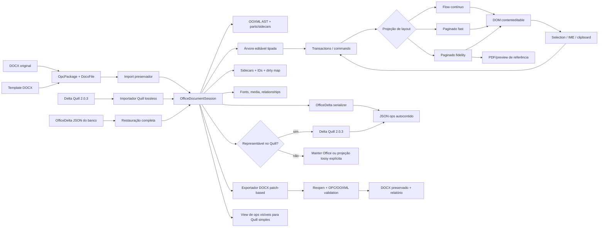

# Plano técnico — modo DOCX paginado avançado sem quebrar o Quill simples

**Data da auditoria:** 2026-07-31  
**Repositório de destino:** `C:\MyDartProjects\dart_quill`  
**Status:** decisão arquitetural e plano de execução; ainda não é uma implementação  
**Escopo auditado:** `dart_quill`, `docx_rendering`, `docx_rendering/resources`, `docx_rendering/resources/word.example`, LibreOffice `core-master` e EuroOffice/ONLYOFFICE DocumentServer.

---

## 0. Resposta direta

É **tecnicamente possível** implementar no `dart_quill` um modo paginado, editável por `contenteditable`, com experiência próxima do Word e boa performance. O material local já contém uma parte considerável da fundação: parser/renderizador DOCX, um port de ProseMirror/Tiptap, régua, tabulações, tabelas, cabeçalhos/rodapés, paginação experimental e, no próprio `dart_quill`, uma pilha OPC/OOXML capaz de preservar partes originais.

Porém, não é correto tratar isso como uma nova opção visual do Quill atual. Um editor Word precisa de uma árvore hierárquica, transações estruturais, mapeamento posição modelo↔DOM, seções, estilos, campos e paginação incremental. Delta é um transporte plano e extensível: custom ops conseguem persistir tudo, mas não substituem a árvore e o layout necessários durante a edição. Tentar executar toda essa lógica dentro de `Scroll`/Parchment recriaria boa parte de ProseMirror, elevaria o custo por tecla e aumentaria o risco de quebrar a compatibilidade com Quill 2.0.3.

### Decisão recomendada

1. **Manter o Quill simples como superfície/default compatível**, com Delta como formato canônico, mesmo entrypoint, CSS e comportamento Quill 2.0.3. Correções de paridade, lifecycle e profiles opcionais por instância são permitidas, mas o engine Office nunca entra nesse caminho.
2. Criar um **engine avançado independente**, interno ao pacote, aproveitando seletivamente o port ProseMirror/Tiptap de `docx_rendering`.
3. Tornar o formato persistente do modo avançado um **OfficeDeltaSnapshot versionado, insert-only, autocontido e formado por uma única lista de ops**: texto/linhas, regiões, metadados, partes OOXML e assets.
4. Usar o `contenteditable` como projeção de edição e entrada de texto, nunca como fonte canônica do documento.
5. Durante a importação, converter o pacote DOCX em `OfficeDeltaSnapshot` sem descartar partes; ao exportar, reconstruir/editar as partes por nós, preservando XML e conteúdo não compreendido.
6. Disponibilizar visualização e edição sobre a mesma sessão/layout, com `readOnly` como estado do editor, evitando dois paginadores incompatíveis.
7. Implementar tudo **100% no frontend em Dart**, sem servidor, binário nativo, WASM de terceiros ou biblioteca JavaScript; `web` e `html` são as únicas dependências Dart de runtime permitidas quando necessárias.
8. Tratar compatibilidade como contrato mensurável: fidelidade de armazenamento, semântica editável, fidelidade visual e comportamento são dimensões diferentes.
9. Fazer o engine avançado aceitar e produzir **documentos Delta compatíveis com o Quill 2.0.3**. Um Delta Quill normal pode alternar entre as duas superfícies sem perda semântica; só recursos Office não representáveis exigem promoção de formato e bloqueiam um retorno silenciosamente lossy ao editor básico.

### Objetivo de produto

O `dart_quill` permanece **genérico**, publicável e utilizável por qualquer
pessoa. Os recursos que hoje existem como plugins da aplicação SALI não são um
dialeto proprietário: são lacunas do Quill TypeScript que tiveram de ser
preenchidas na aplicação — imagem de cabeçalho, correção do paste do Word,
régua/margens/orientação de página, exportação para PDF e para HTML puro sem
dependência de CSS. No port, cada um vira funcionalidade nativa e configurável
do pacote.

O SALI é o primeiro consumidor, com dois requisitos de rollout inegociáveis
por ser um sistema de processo administrativo (ETP, TR, memorandos, ofícios,
despachos):

1. os Deltas Quill já gravados no banco — inclusive rascunhos de despacho —
   continuam abrindo e sendo editáveis sem quebra;
2. a conversão para PDF existente continua funcionando sem regressão.

Sobre essa base genérica entra o modo avançado: edição paginada estilo Word,
com alto desempenho para documentos grandes (150+ páginas).

### Limite honesto

É viável obter alta fidelidade para um subconjunto explicitamente suportado e preservação sem perdas do conteúdo não alterado. Não é honesto prometer paridade visual absoluta com qualquer arquivo Word. O Word Online usa um motor proprietário de line layout, paginação cliente e WASM; ONLYOFFICE e LibreOffice também possuem motores de layout próprios, acumulados durante anos. Fontes, fallback, hinting, hifenização e detalhes do algoritmo alteram quebras de linha e página.

| Requisito | Veredito |
|---|---|
| 100% frontend, sem backend | sim |
| source de produção 100% Dart | sim; allowlist de dependências `web` e `html` |
| Dart compilado para JS/Wasm e Web Workers | sim; artefato próprio, com fallback |
| armazenar DOCX completo como uma lista JSON de ops | sim, com `OfficeDeltaSnapshot` |
| reabrir sem guardar o binário `.docx` | sim, preservando parts/assets nos ops; ZIP físico pode diferir |
| Delta Quill 2.0.3 básico↔avançado | sim após corrigir os blockers locais e enquanto o profile for representável |
| paginação leve e paginação Word-like | sim, `fast` e `fidelity` sobre a mesma sessão |
| visual idêntico a qualquer Word | não é garantível universalmente; é gate mensurável por feature/corpus/fontes |
| “somente contenteditable” como engine completo | não; contenteditable é a superfície de entrada, modelo/layout continuam próprios |

O usuário está correto que a **estrutura Delta é extensível**. `Operation.insert` aceita dados dinâmicos/Map, atributos aceitam mapas aninhados, e `table_better` já usa isso para linhas e células. Portanto, é possível guardar todo o estado DOCX em uma única lista de ops.

A distinção necessária é entre:

- **QuillDeltaDocument** — documento Delta normal compatível com Quill 2.0.3, editável nas duas superfícies;
- **vocabulário Delta padrão** — bold, header, list, link etc.; insuficiente sozinho para representar DOCX;
- **estrutura Delta extensível** — capaz de transportar novos atributos e embeds;
- **OfficeDeltaSnapshot** — dialeto insert-only que define a semântica desses novos ops e é salvo no banco;
- **visibleDelta** — documento Delta Quill normal derivado do snapshot para a superfície simples.

Com ops `office-manifest`, `office-part`, `office-asset`, `office-region-*`, `office-section-break`, `office-field`, `office-table-*` etc., o banco guarda somente `{"ops": [...]}`. Não existe objeto lateral. O snapshot completo não é enviado cru ao `Quill.setContents`: o adapter deriva `visibleDelta`, assim como table-better exige um vocabulário/registro conhecido.

Um JSON Delta sem `office-manifest` continua sendo Delta Quill normal. O modo avançado o importa para sua árvore, edita os mesmos atributos/embeds suportados e o devolve como Delta Quill enquanto ele permanecer representável nesse perfil. O formato só é promovido para `OfficeDeltaSnapshot` quando o usuário usa seção, margem persistida, header/footer, field, tabela Word ou outro recurso Office. Promoção nunca significa perda; downgrade só é permitido quando uma análise prova que também é lossless.

O objetivo de produto deve ser:

> editar com alta fidelidade o conjunto suportado, nunca perder silenciosamente o que não é suportado e preservar integralmente tudo que o usuário não tocou.

---

## 1. Requisitos não negociáveis

O projeto deve preservar estes contratos:

- o entrypoint `lib/dart_quill.dart` não passa a importar nem inicializar o engine Word;
- documentos Delta canônicos existentes continuam com a semântica/DOM do Quill 2.0.3; divergências locais comprovadas são corrigidas e cobertas por golden, não preservadas como “compatibilidade”;
- JSON `{"ops":[...]}` produzido pelo Quill 2.0.3 abre no modo básico e no avançado;
- um documento restrito ao perfil Quill 2.0.3 pode alternar básico↔avançado e voltar a um Delta semanticamente idêntico após a normalização oficial do Quill;
- o modo avançado preserva atributos/embeds Quill desconhecidos sem alteração; se não souber renderizá-los ou uma edição tocar sua faixa, deve avisar ou bloquear a operação preservadora;
- adicionar um recurso exclusivo de Office promove o payload para `OfficeDeltaSnapshot`; o sistema nunca o rebaixa automaticamente para Delta básico;
- `registerTableBetter()` e outros registries globais do Quill não são usados pelo engine Word;
- CSS e assets do modo Office são escopados e não alteram `.ql-editor`, temas ou aplicações consumidoras;
- Quill simples e editor Office podem existir simultaneamente na mesma página;
- abrir um DOCX não destrói partes OOXML desconhecidas;
- conversões para o vocabulário Delta básico são classificadas como projeções com possíveis perdas; DOCX↔OfficeDelta customizado deve ser preservador;
- nenhuma perda pode ser silenciosa: toda importação, conversão e gravação produz um relatório de compatibilidade;
- o estado completo de um DOCX pode ser serializado em uma única lista `OfficeDeltaSnapshot`/JSON de custom ops e reaberto sem os bytes `.docx` originais;
- imagens, fontes incorporadas, embeddings e outras partes binárias são armazenados como ops `office-asset` autocontidos (deflate+base64); nenhum dado necessário fica fora do Delta;
- edição paginada continua responsiva em documentos grandes e não faz um diff/rebuild do documento inteiro a cada tecla;
- viewer e editor compartilham a mesma semântica de estilos, fontes, seções e paginação;
- o paginador oferece `fast` (fluxo leve/aproximado) e `fidelity` (Word-like mais pesado) sobre a mesma sessão, sem alterar o conteúdo ao alternar;
- a implementação web deve funcionar primeiro em Chromium, mas só será declarada estável após gates de Firefox, Safari, IME e mobile;
- não haverá backend, iframe de editor, LibreOfficeKit, DocumentServer, `x2t`, processo headless ou chamada de conversão remota em runtime;
- não haverá dependência de ProseMirror/Tiptap/docxjs em JavaScript: somente o código Dart auditado e incorporado ao repositório;
- `web: ^1.1.1` e `html: ^0.15.4` podem permanecer quando necessários; nenhuma outra dependência direta de produção é aceita sem nova decisão arquitetural;
- imports diretos de packages transitivos, como `collection`, precisam ser removidos/substituídos ou formalmente adicionados à allowlist pelo usuário;
- são permitidas apenas bibliotecas `dart:*` do SDK, incluindo `dart:js_interop`, e APIs nativas do browser; JavaScript ou WebAssembly **gerados a partir do próprio source Dart** são artefatos válidos, mas nenhuma biblioteca JS/WASM externa é carregada;
- artefatos proprietários da captura do Word Online nunca entram no pacote, no repositório ou na distribuição.

---

## 2. Método e evidências auditadas

Esta conclusão não parte apenas de desenho teórico. Foram lidos os códigos dos cinco conjuntos locais, seus relatórios, testes, exemplos e imagens de comparação.

### 2.1 `dart_quill`

O repositório já não é apenas um wrapper. Ele contém:

- port Dart do Quill 2.0.3 e `quill-table-better`;
- Delta, Parchment/Scroll, seleção, histórico, clipboard, tabelas e temas;
- ZIP/deflate, XML, OPC, fontes TrueType, DOCX, PDF e pontes Word em `lib/src/office`;
- entrypoints separados para Quill, DOCX, HTML, PDF e table-better.

O `pubspec.yaml` atual usa `web: ^1.1.1` e `html: ^0.15.4`, agora explicitamente aceitos. O problema restante é que arquivos centrais importam `package:collection` por resolução transitiva sem declará-lo diretamente; isso viola a allowlist e a disciplina do `pubspec`.

`package:html` pode continuar fornecendo parsing HTML5 real e sanitização/conversão, sem tentar tratar HTML como XML. `package:web` pode continuar fornecendo bindings tipados do browser. Ambos são Dart e não introduzem engine JavaScript/servidor. Helpers usados diretamente de `collection` viram código interno testado, salvo autorização futura explícita. `dev_dependencies` podem continuar restritas a build/test e nunca ser importadas por `lib/`.

Os conversores públicos atuais em `lib/src/converters/docx/docx_codec.dart` são úteis para interoperabilidade simples, mas são **lossy**. Em particular, listas podem virar marcadores literais, somente o corpo principal é projetado e o conversor não define custom ops para geometrias de página/cabeçalhos/rodapés. A limitação está no codec/vocabulário atual, não na capacidade aberta da estrutura Delta.

A camada interna é muito mais promissora:

- `lib/src/office/document/docx/reader.dart` mantém `DocxFile`, pacote OPC, estilos, numeração, settings e relações;
- `lib/src/office/document/docx/model.dart` representa propriedades de parágrafo, tab stops, keep-next/keep-lines, widow control, tabelas, seções e nós preservados;
- `WpPreservedBlock`, `WpPreservedInline` e `WpPreservedRunContent` guardam XML ainda não modelado;
- `lib/src/office/document/docx/writer.dart` reaproveita o pacote original e pode devolver os bytes originais quando nada foi alterado;
- `lib/src/office/word/element_to_docx.dart` já reaproveita blocos originais não alterados.

Esse é o início correto para round-trip. A limitação atual é que uma alteração pode invalidar um parágrafo/tabela inteiro e provocar regeneração mais ampla do XML. O modo avançado exigirá preservação granular dentro de parágrafos, runs, relações, tabelas, campos e seções.

Também foi verificado um risco de desempenho do engine Quill para este novo caso. A sincronização nativa pode reconstruir o Delta do documento e calcular diff; vários índices no blot tree são lineares. Isso é aceitável no contrato atual e vem sendo trabalhado para paridade com o upstream, mas não deve ser sobrecarregado com paginação, campos e árvore Word.

**Baseline observado nesta auditoria:**

- `pubspec` exige SDK `^3.6.0`; o ambiente auditado usa Dart 3.6.2 stable;
- nesse SDK, `dart compile` expõe targets `js` e `wasm`, portanto UI/worker gerados do mesmo source Dart são tecnicamente possíveis sem biblioteca externa;
- `dart analyze`: sem erros;
- `dart test test/unit`: 1.113 casos aprovados na validação final;
- a execução agregada de todas as suítes excedeu a janela de 120 segundos, portanto browser/E2E devem permanecer jobs separados e sequenciais, conforme a prática já documentada pelo projeto.

### 2.2 `docx_rendering`

O projeto possui quatro superfícies distintas:

- `lib/docx_rendering.dart`: viewer DOCX baseado no port do docxjs;
- `lib/prosemirror.dart`: árvore, estado, transações e view;
- `lib/tiptap.dart`: extensões, conversores, UI e editor;
- `lib/quill_delta.dart`: implementação Delta independente.

Em volume, há aproximadamente:

- 54 arquivos / 13,8 mil linhas no port ProseMirror;
- 50 arquivos / 14,5 mil linhas no port Tiptap, extensões, UI e conversores;
- 43 arquivos de testes ProseMirror/Tiptap, com cerca de 8,7 mil linhas.

O editor já demonstra, em Chromium:

- `contenteditable` e transações estruturais;
- modos visuais compact/simple/word/viewer;
- ribbon;
- régua horizontal e vertical;
- margens, recuo esquerdo/direito, primeira linha e deslocamento;
- tab stops left/center/right/decimal e líderes;
- modo de régua para colunas de tabela;
- tabelas editáveis, resize, inserir/excluir linha/coluna, merge/split, bordas e header row;
- configuração de página;
- cabeçalho e rodapé;
- placeholders de PAGE/NUMPAGES;
- inserção/atualização experimental de sumário;
- estilos, fontes e cores;
- importação e exportação DOCX/Delta/PDF.

Isso comprova a viabilidade de UX e economiza muito trabalho. Mas há bloqueios de produção:

- o reconciliador DOM ainda é parcial e pode engolir falhas;
- `beforeinput`, seleção por clique, drag/drop, clipboard e IME não estão completos em todos os browsers;
- a paginação do editor usa uma cadeia de floats e mantém o documento inteiro no DOM;
- não existe virtualização real do editor;
- viewer e editor usam paginadores independentes;
- o importador achata estilos e uma única seção em atributos globais;
- o exportador cria um pacote DOCX novo e mínimo;
- cabeçalhos, rodapés, campos, estilos customizados e várias propriedades importadas não fazem round-trip;
- o editor não mantém vínculo estável entre um PM node e seu XML/parte original.

Portanto, o código é uma **fundação de alta qualidade e um protótipo avançado**, não uma solução pronta para ser copiada inteira.

### 2.3 `resources`: corpus e comparação visual

Os documentos locais são valiosos para carga e regressão:

| Corpus | Escala observada | Conteúdo relevante |
|---|---:|---|
| ETP | 19 páginas, ~6.860 palavras, 524 parágrafos, 3 tabelas | 158 estilos, numeração complexa, headers/footers, imagens |
| TR | 140 páginas, ~81.407 palavras, 4.414 parágrafos, 22 tabelas | 181 estilos, 1.642 linhas e 3.650 células, 724 tabs, tabelas longas e merges |

Os totais de páginas/palavras vêm dos valores cacheados em `docProps/app.xml`; não são uma repaginação independente. As contagens `w:p` incluem parágrafos dentro de células. O harness deve registrar origem/método de cada métrica.

As capturas do editor demonstram um ambiente Word-like real. A comparação da primeira página de referência com a gerada mostra, ao mesmo tempo, a viabilidade e as lacunas: numeração hierárquica diferente, métricas de linha/página distintas, densidade de tabela menor, wrapping de células diferente e footer desalinhado.

O corpus atual, contudo, possui apenas uma seção nos documentos grandes. Ele não basta para certificar:

- múltiplas seções;
- orientação e margens alternadas;
- first/even headers por seção;
- comentários e tracked changes;
- notas de rodapé/fim;
- campos complexos no body;
- equações, charts, SmartArt, OLE e assinaturas;
- documentos RTL/CJK e hifenização.

Novos fixtures precisam cobrir essas classes antes de se declarar alta fidelidade geral.

### 2.4 `resources/word.example`

A captura contém aproximadamente 460 arquivos e 93 MB, incluindo um bundle Word de quase 5 MB e `linelayout-core.wasm` de aproximadamente 41,8 MB. Ela evidencia/indica conceitos importantes, sem constituir documentação normativa:

- existe uma Editing Surface controlada/floating baseada em DOM/`contenteditable`, não evidência de que toda página seja uma única raiz nativa;
- a captura configura `spellcheck=false` nessa superfície;
- input, graph updater, seleção lógica, caret, composição e IME são camadas próprias;
- tabulações e list markers são materializados;
- o layout/paginação não é delegado somente ao CSS do browser;
- há motor WASM de line layout;
- o bundle contém modos `FullDocumentRendered` e `VirtualizationWindow`; ele evidencia suporte à virtualização, não que somente uma janela esteja sempre ativa.

A lição relevante é arquitetural: o `contenteditable` é uma superfície intermediada pelo modelo, não prova de seleção/spellcheck/layout inteiramente nativos. O DOM é uma projeção controlada, com mapeamento lógico de posições e layout próprio.

Esse material é **proprietário da Microsoft** e não possui licença de redistribuição. Não se pode copiar bundle, CSS, WASM, protocolo ou implementação. Além disso, a captura contém canaries/tokens e dados de sessão em arquivos não versionados. Ela deve permanecer ignorada, ser tratada como segredo e nunca ser publicada ou anexada a releases. É necessário verificar também o histórico do repositório; qualquer segredo que já tenha sido compartilhado deve ser revogado/rotacionado, pois `.gitignore` não corrige exposição anterior.

### 2.5 EuroOffice / ONLYOFFICE DocumentServer

O código em `D:\EuroOfficeNative\DocumentServer` é uma distribuição baseada em ONLYOFFICE DocumentServer. Ele oferece um editor Word-class completo:

- modelo de documento próprio;
- paginação incremental e time-sliced;
- fast paths de recálculo;
- parágrafos com widow/orphan/keep;
- tabelas quebradas por página;
- estilos e numeração;
- seções, cabeçalhos, rodapés;
- campos TOC/PAGE/NUMPAGES/PAGEREF/STYLEREF;
- régua e tab stops.

Arquivos examinados somente durante a auditoria de viabilidade, excluídos da implementação:

- `sdkjs/word/Editor/Document.js`;
- `sdkjs/word/Editor/Paragraph_Recalculate.js`;
- `sdkjs/word/Editor/Table/TableRecalculate.js`;
- `sdkjs/word/Editor/Paragraph/ComplexFieldInstruction.js`;
- `sdkjs/word/Drawing/Rulers.js`;
- `sdkjs/word/Editor/Layout/PrintView.js`.

Ele **não é contenteditable**. O conteúdo e a seleção são desenhados em canvas; textarea/elemento transparente serve apenas como shim de teclado, IME e clipboard. `DocsAPI.DocEditor` integra o produto por iframe/postMessage com serviço, storage, callback, JWT e ciclo de gravação.

Sob os requisitos deste plano, DocumentServer e `x2t` **não são rotas de implementação**. O source foi analisado nesta auditoria apenas para avaliar viabilidade, riscos e classes de comportamento. Nenhum arquivo, algoritmo traduzido/refraseado, bundle ou processo entra no produto. Requisitos normativos devem vir de ECMA-376/ISO 29500, documentação pública e testes black-box, não da expressão do código AGPL.

O motor está sob **AGPL-3.0**, incluindo requisitos adicionais de avisos de interface; GUI, ícones e material técnico possuem ainda ativos CC BY-SA 4.0. Código, UI e ativos estão excluídos do produto. Não se deve copiar ou traduzir sua expressão para `dart_quill`.

### 2.6 LibreOffice `core-master`

O filtro OOXML do LibreOffice é maduro e cobre estilos, numeração, tabelas, seções, headers/footers, campos, comentários, custom XML, VBA e embeddings. O layout Writer possui árvore própria de páginas/frames, follows de parágrafos, widow/orphan, divisão de tabelas, invalidação incremental, caminho rápido e cache de páginas.

É uma ótima referência conceitual e um comparador secundário de interoperabilidade, mas é profundamente acoplado a C++, Writer, UNO e VCL. ECMA-376/ISO 29500 define o formato, e o Microsoft Word é a principal referência comportamental; LibreOffice também possui aproximações e perdas próprias.

Sob a restrição frontend-only, os usos adequados nesta investigação se limitam a:

- comparação conceitual durante esta auditoria, sem reutilização de código;
- criação manual, fora do runtime do produto, de fixtures e resultados esperados;
- comparação durante o desenvolvimento, sem virar requisito da biblioteca publicada.

Usos inadequados:

- copiar o motor Writer para dentro do `dart_quill`;
- assumir que o build WASM experimental é um editor web pronto;
- usar LOK como se fosse `contenteditable`.

O build WASM existente é experimental, exige threads/atomics e headers COOP/COEP, possui bindings incompletos e alto custo de memória/link. A licença predominante dos arquivos avaliados é MPL-2.0, com material LGPL/Apache em partes; qualquer reutilização exige revisão por arquivo. Neste plano, LibreOffice foi fonte de comparação da auditoria; processo, binário, port direto e transposição de algoritmos estão excluídos.

---

## 3. O que “fidelidade” deve significar

Usar uma única porcentagem de fidelidade esconderia problemas. O projeto deve medir quatro eixos:

| Eixo | Pergunta | Critério de sucesso |
|---|---|---|
| Armazenamento/pacote | Algo que não foi editado sobrevive ao save? | partes e XML intocados preservados; sem perda silenciosa |
| Semântica editável | O usuário consegue editar a feature e reabri-la? | modelo e OOXML equivalentes para o subconjunto suportado |
| Visual/paginação | O documento aparece no lugar correto? | métricas, quebras, tabelas e page chrome dentro de tolerâncias definidas |
| Comportamento | A interação se comporta como editor profissional? | seleção, IME, undo, clipboard, régua, campos e tabelas consistentes |

Cada feature deve ser classificada por documento/nó:

- **editável e serializável**;
- **renderizada com aproximação e preservada**;
- **preservada opaca, não editável**;
- **não suportada e bloqueadora**;
- **perdida** — permitido apenas em conversão explicitamente lossy, nunca no save padrão de DOCX.

Exemplos:

| Feature | Primeira meta | Meta posterior |
|---|---|---|
| texto, runs, parágrafo, styles, numeração | editável + round-trip | layout refinado |
| tabelas com gridSpan/vMerge | editável + preservação | divisão Word-like de linhas/células |
| headers/footers default/first/even | editável por seção | objetos flutuantes completos |
| TOC/PAGE/NUMPAGES | campo estruturado, resultado recalculável | paridade de switches Word |
| drawings/charts/SmartArt/OLE | render/preservação opaca | edição especializada |
| comentários/track changes | preservação opaca inicial | UI e edição semântica |
| macros/assinaturas | preservação quando seguro ou save bloqueado | política dedicada |

Casos que exigem política especial:

- DOCX criptografado/protegido por senha não é um ZIP OOXML comum e pode ser recusado no v1;
- editar conteúdo/part coberta por assinatura invalida a assinatura; a política conservadora deve bloquear ou removê-la explicitamente com aviso, nunca presumir validade;
- external relationships não são buscadas automaticamente;
- conteúdo com restrição de edição pode ser preservado, mas o editor precisa respeitar a política declarada;
- `.docm`/macros não faz parte do escopo DOCX inicial; se aceito futuramente, o VBA será opaco e nunca executado.

O resultado de abrir e salvar deve incluir um `CompatibilityReport`, com ao menos:

```text
feature | part | nodeId | severity | capability | action | message
```

Uma política `strict` deve poder impedir o save se uma edição cruzar conteúdo que não pode ser preservado. A política padrão deve preservar e avisar.

---

## 4. Decisão entre os caminhos possíveis

| Caminho | Prazo inicial | Fidelidade potencial | Contenteditable | Risco ao Quill simples | Licença/operação | Decisão |
|---|---:|---:|---:|---:|---:|---|
| adicionar páginas/blots ao Quill/Delta | aparentemente curto, na prática muito alto | média | sim | **alto** | simples | rejeitar |
| engine ProseMirror/Tiptap **portado em Dart** + OfficeDelta | alto, mas grande base pronta | alta no subconjunto suportado | **sim** | **baixo** | código Dart local, após auditoria | **recomendado** |
| copiar viewer HTML e editar o DOM | médio | baixa no round-trip | parcialmente | médio | Apache + código local | rejeitar como engine |
| ONLYOFFICE por iframe/servidor | curto para UX completa | madura, dependente do corpus/fontes | não, canvas | baixo | AGPL + backend | **proibido pelos requisitos** |
| LibreOfficeKit/tiles | muito alto | madura, dependente do corpus/fontes | não | baixo | nativo | **proibido pelos requisitos** |
| LibreOffice headless/x2t | baixo para conversão | conversão madura, não lossless universal | não | nenhum | processo/servidor | **proibido pelos requisitos** |

### Por que não evoluir `Scroll`/Delta

Para suportar Word seria necessário acrescentar ao Quill:

- schema hierárquico;
- steps/transações;
- mapeamento de posições após cada transformação;
- decorations;
- seleção entre fragments/páginas;
- regiões separadas para header/footer;
- estados de plugin;
- layout incremental;
- sidecar OOXML;
- tabelas estruturais e seções.

Isso equivale a criar uma versão parcial do que o port ProseMirror já oferece. Além disso, o Quill atual pode reconstruir e comparar o Delta completo ao absorver mutações nativas. Em um documento de 140–200 páginas, adicionar paginação a esse caminho cria risco de trabalho O(documento) por tecla.

### Por que o port ProseMirror/Tiptap é a melhor base

Já existem:

- árvore persistente com compartilhamento estrutural;
- `Transaction`, `Step`, `Mapping` e seleção mapeada;
- atualização localizada de `ViewDesc`;
- schema/extensões por instância;
- lifecycle/destroy;
- contenteditable e DOM observer;
- histórico e comandos;
- protótipos das features Word.

Ele ainda precisa de hardening, paginação nova e bridges OOXML preservadoras. Mesmo assim, é uma fundação substancialmente melhor e permite isolamento real do Quill.

---

## 5. Modos públicos e isolamento

“Simples”, “viewer” e “paginado” não devem ser um único enum, pois representam dimensões diferentes.

### 5.1 Superfícies

| Superfície | Modelo canônico | Uso |
|---|---|---|
| `Quill` existente | `QuillDeltaDocument` | edição rich-text simples e compatibilidade Quill 2.0.3 |
| `Quill` read-only | `QuillDeltaDocument` | visualização simples de Delta |
| `OfficeDocumentViewer` | árvore de uma `OfficeDocumentSession` | Quill Delta, DOCX ou OfficeDelta paginado/flow sem edição |
| `OfficeDocumentEditor` | árvore de uma `OfficeDocumentSession` | Quill Delta ou edição avançada Word-like |

### 5.2 Dimensões do modo Office

```dart
enum OfficeAccess { view, edit }
enum OfficeLayout { flow, paged }
enum OfficePaginationMode { fast, fidelity }
enum OfficeComputeBackend {
  auto,
  wasmWorker,
  jsWorker,
  mainThreadCooperative,
}
```

O mesmo editor/sessão troca `OfficeAccess`, `OfficeLayout` e `OfficePaginationMode` sem reimportar ou converter o documento. `flow`, `paged + fast` e `paged + fidelity` são projeções da mesma árvore. O modo de paginação só se aplica quando `layout == OfficeLayout.paged`. `OfficeComputeBackend` escolhe onde executar trabalho puro; não muda semântica, JSON, hashes ou resultado determinístico.

### 5.3 Regras de conversão

- DOCX deve abrir por padrão em `OfficeDocumentSession` e ser imediatamente representável como `OfficeDeltaSnapshot`.
- Delta padrão deve abrir no Quill simples por padrão, mas a API permite abri-lo diretamente no modo avançado.
- Delta padrão é importado sem inventar propriedades Word persistentes. A paginação inicial pode usar defaults de apresentação efêmeros.
- Enquanto a árvore usar apenas recursos mapeáveis para Quill 2.0.3, `exportQuillDelta(requireLossless)` permanece disponível e a persistência continua sendo Delta padrão.
- Ao primeiro recurso Office persistente, a sessão é promovida para `OfficeDeltaSnapshot`, mantendo todo o conteúdo Quill.
- OfficeDelta reabre no viewer/editor avançado com todo o modelo, parts e assets.
- O snapshot contém ops de conteúdo e ops de metadados/parts/assets. O Quill simples recebe apenas `visibleDelta`; o engine Office retém todos.
- DOCX→vocabulário Delta básico continua sendo uma conversão lossy; DOCX→OfficeDelta customizado é o caminho preservador.
- alternar visualmente `view`↔`edit` no modo Office não faz conversão;
- para um Delta Quill compatível, alternar `Quill`↔`Office` é um handoff lossless e deve parecer uma troca de modo ao usuário, embora internamente existam dois engines;
- para um documento Office rico, voltar ao modo básico editável exige `canExportQuillLosslessly == true`; caso contrário, o switch é bloqueado ou abre apenas uma cópia/projeção explicitamente lossy.

### 5.4 Contrato de alternância Quill 2.0.3

O requisito de alternância vale integralmente para **documentos Quill normais**. Ele não autoriza descartar silenciosamente uma margem, seção, nota, field ou header que o Quill básico não consegue expressar.

| Payload atual | Básico | Avançado | Retorno preservador ao básico | Formato salvo |
|---|---:|---:|---|---|
| Delta Quill com formatos built-in | edita | edita | sempre, após normalização Quill | Delta Quill |
| Delta com table-better suportado | edita com módulo registrado | edita via mapeador próprio | sim, com o mesmo perfil table-better | Delta Quill |
| Delta com formato/embed custom desconhecido | depende do registry da aplicação | preserva opaco; não edita sem adapter | somente se intocado **e** suportado pelo profile básico destino | Delta Quill |
| `OfficeDeltaSnapshot` | somente projeção/cópia | edita integralmente | apenas se o relatório provar zero perda | OfficeDelta |
| DOCX importado | somente projeção/cópia | edita integralmente | apenas se o relatório provar zero perda | OfficeDelta |

O perfil de interoperabilidade deve espelhar o comportamento observado nos goldens locais do Quill 2.0.3:

- aceitar o wrapper JSON `{"ops":[...]}` e, na API Dart, a lista usada por `Delta.fromJson`;
- aceitar somente document Deltas insert-only como estado persistente; `retain` e `delete` são change Deltas e só entram por uma API de aplicação de transação;
- preservar texto, newline final e atributos inline/bloco segundo a normalização de `Quill.setContents().getContents()`;
- mapear os formatos built-in: bold, italic, underline, strike, link, code, script, color, background, font, size, header, blockquote, code-block, list, indent, align, direction, image, video, formula e tabelas suportadas;
- validar os valores canônicos de cada formato, pois whitelists e sanitizers podem descartar ou reescrever o valor;
- mapear o vocabulário local de table-better quando habilitado;
- copiar profundamente valores JSON de atributos e embeds desconhecidos e carregá-los como nós opacos ancorados;
- comparar equivalência semântica/canônica, não segmentação arbitrária de ops. Um no-op pode preservar o JSON original; depois de edição, ops adjacentes equivalentes podem ser compactados como o Quill faz.

O controlador de modo mantém seleção por uma âncora lógica UTF-16. Ele aguarda `compositionend` real, reconcilia DOM/modelo, cria snapshot deep-frozen, executa preflight e monta o destino de forma transacional. Só depois de o destino aceitar conteúdo/seleção ele desmonta ou desabilita a origem. Os dois editores nunca escrevem simultaneamente. Undo/redo pode ser reiniciado no primeiro MVP; histórico atravessando engines só será prometido depois de existir um formato comum de transações.

As disposições de compatibilidade devem ser públicas:

```dart
enum QuillCompatibility {
  lossless,
  losslessAfterQuillNormalization,
  securityNormalized,
  opaquePreserved,
  projectionOnly,
  blocked,
}
```

`securityNormalized` cobre, por exemplo, URL proibida reescrita pelo sanitizer e não deve ser chamada de igualdade exata. `opaquePreserved` ainda permite retorno se nenhum op opaco foi invalidado e o destino souber montá-lo. `projectionOnly` nunca permite sobrescrever o payload completo com o Delta básico; `blocked` impede até a montagem.

A comparação deve usar um `QuillInteropProfile` por sessão: registry, factories de módulos, embed handlers, formatos built-in habilitados, whitelist `formats`, table-better ativo e adapters Dart fornecidos pela aplicação para blots próprios. O novo fluxo não copia nem muta o registry global; isso exige a refatoração listada abaixo. Sem adapter, um formato custom continua preservável como opaco, mas não passa a ser editável no modo avançado. Trocar para uma instância básica com profile diferente também exige novo compatibility check.

Perfis mínimos:

- `quill203Core`: core, tabela simples e valores canônicos do upstream;
- `dartQuillLocal`: extensões locais deliberadas, após corrigir seus round-trips;
- `quillTableBetter123`: formatos, clipboard e módulo table-better isolados;
- profile custom da aplicação: adapters/whitelists explícitos.

O JSON Delta padrão não carrega um registry. Para ops core, o profile pode ser inferido; table-better possui vocabulário identificável; para blot custom o chamador precisa fornecer o adapter/configuração de runtime. Isso não é conteúdo persistente lateral e não pode ser necessário para reconstruir um DOCX Office; é somente a capacidade da superfície Quill escolhida.

#### 5.4.1 Bloqueios reais encontrados no port atual

A alternância é uma meta, não uma capacidade que o código atual já possa declarar. A auditoria encontrou estes pré-requisitos:

| Estado atual | Consequência | Correção/gate obrigatório |
|---|---|---|
| `Delta.fromJson`/`toJson` trabalham com a lista, não com `{"ops":[...]}` | JSON comum exige parsing manual | `DeltaJsonCodec` estrito aceita ambos e sempre persiste wrapper |
| `Quill.getContents()` devolve o `Editor.delta` interno mutável | chamador pode corromper o editor; diverge do slice do Quill 2.0.3 | retornar/capturar cópia e criar snapshot deep-frozen |
| `Operation` copia só o Map externo | payload/atributo aninhado continua mutável | deep copy/freeze no boundary |
| atributo desconhecido vira no-op; embed desconhecido lança | perda silenciosa ou falha ao montar | preflight contra capabilities da instância antes de `setContents` |
| registries, modules e Delta embed handlers possuem estado global | table-better muda instâncias básicas criadas depois | `QuillEnvironment/Profile` opcional por instância, defaults retrocompatíveis |
| `registerTableBetter()` sobrescreve formatos e clipboard globais | tabela básica e table-better podem formar registry híbrido inválido | não usar o registro global no novo fluxo; profiles separados |
| whitelists default de `font`/`size` são estreitas | Arial/Calibri/valores em pt podem desaparecer | profile documentado ou attributors locais por documento; reportar normalização |
| fórmula pode reemitir `attributes.formula` redundante | Delta difere do Quill 2.0.3 | corrigir antes do gate estrito |
| tabela simples emite `colspan`/`rowspan`, mas não os reidrata | merge se perde no reload | corrigir ou bloquear round-trip com spans |
| `table-embed` tem handler OT, mas nenhum blot/renderer | `setContents` falha visualmente | não anunciar como conteúdo editável até existir renderer |
| `table-temporary` do table-better é persistente | tratá-lo como lixo perde estilo da tabela | incluí-lo no codec/canonicalização do profile |
| `{retain: {embed: ...}}` do Quill 2 não passa pelo codec atual | change Delta de embed é incompatível | ampliar `Operation`/codec antes de expor `applyQuillChange` completo |
| diff pode cortar par substituto UTF-16 | seleção/OT pode parar dentro de emoji | corrigir prefix/suffix e testar surrogate pairs |
| custom inline embed com payload Map pode perder a chave do blot | JSON reemitido muda de schema | corrigir serializer e adicionar golden |
| sanitização de imagem inválida remove o blot localmente | diverge do comportamento upstream e perde conteúdo | alinhar política ou classificar/bloquear como `securityNormalized` |
| não há lifecycle público completo para a instância Quill | toggle repetido pode vazar observer/listeners | adicionar `dispose()` retrocompatível ou manter/desabilitar instância sob controle explícito |

O bridge usa offsets UTF-16, como Quill e DOM, enquanto o modelo Office usa um `PositionMap` explícito para seus tokens estruturais. CRLF→LF, newline final, junção de ops, atributos vazios, booleanos truthy, cores e `code-block` podem ser normalizações canônicas documentadas. Sanitização de link/image/video é `securityNormalized`, não “lossless”.

O validador de document Delta rejeita antes de montar: op sem exatamente uma chave operacional; `retain`/`delete`; embed não-Map, vazio ou com múltiplas chaves; atributos não-Map/chaves não-string; tipo/valor inválido por formato; blocos exclusivos conflitantes; profundidade, quantidade ou payload acima dos limites. Assim o modo básico nunca é usado como detector destrutivo de compatibilidade.

Canonicalização não pode ordenar atributos Quill de modo genérico. O table-better atual depende da aplicação estrutural em ordem conhecida — por exemplo, `table-cell-block` antes de `table-cell`. O codec define ordem por profile/formato; hashes usam uma representação canônica separada sem mudar a ordem de montagem.

### 5.5 Entry point

Proposta:

```text
lib/dart_quill.dart                  # inalterado: Quill/Delta
lib/dart_quill_office.dart           # novo: API Office
lib/dart_quill_docx.dart             # codecs existentes/compatibilidade
lib/dart_quill_html.dart             # inalterado: Delta -> HTML semântico
lib/dart_quill_pdf.dart              # inalterado: Delta -> PDF
lib/dart_quill_table_better.dart     # inalterado: plugin de tabelas
```

O novo entrypoint não deve exportar tipos ProseMirror/Tiptap. Eles são detalhes internos e podem evoluir sem quebrar a API pública.

---

## 6. Arquitetura alvo



### 6.1 `OfficeDocumentSession`

A sessão é o centro do modo avançado. Ela deve manter:

```dart
final class OfficeDocumentSession {
  final Uint8List? originalDocxBytes; // disponível apenas logo após import
  final DocumentPersistencePayload persistence; // QuillDelta ou OfficeDelta
  final OfficePackageSnapshot? package;
  final DocxFile? originalDocx;
  final OfficeDocument document;
  final OfficeSourceMap sourceMap;
  final OfficeAssetStore assets;
  final OfficeStyleRegistry styles;
  final OfficeNumberingRegistry numbering;
  final OfficeDirtyMap dirty;
  final CompatibilityReport compatibility;

  QuillDeltaDocument? get quillDocument;
  OfficeDeltaSnapshot? get officeSnapshot;
  bool get canExportQuillLosslessly;
}
```

Responsabilidades:

- reter o pacote OPC original durante toda sessão originada em DOCX/OfficeDelta;
- conseguir reconstruir esse pacote a partir do OfficeDelta, sem os bytes DOCX originais;
- manter um Delta Quill como payload persistente enquanto a sessão continuar no perfil 2.0.3;
- mapear parte/XML↔nó editável por IDs estáveis;
- derivar caches/sidecars em memória dos custom ops, incluindo ordem dos filhos, sem estado persistente lateral;
- resolver estilos, numeração, themes e defaults sem achatar a origem;
- armazenar seções reais, não somente uma geometria global;
- carregar headers/footers por tipo e por seção;
- gerenciar media, fontes, relationships e content types;
- aplicar transações atômicas ao texto e metadados;
- marcar o menor escopo sujo possível;
- gerar relatório incremental de compatibilidade;
- salvar sobre o pacote original;
- produzir projeções Delta/HTML/PDF sem alterar a fonte.

### 6.2 Três representações, contratos diferentes

1. **Payload persistente:** exatamente um `QuillDeltaDocument` ou `OfficeDeltaSnapshot`. No snapshot Office, raw OOXML é baseline ou materialização conforme o `mode` da part.
2. **Árvore editável:** verdade para comandos, seleção e undo durante a sessão.
3. **Layout/view:** cache descartável e reproduzível.

```dart
sealed class DocumentPersistencePayload {}

final class QuillDeltaDocument extends DocumentPersistencePayload {
  final List<QuillDocumentOp> ops; // insert-only, deep-frozen

  Delta toDelta();
  String get canonicalHash;
}
```

O payload Quill e o snapshot Office nunca são coautoritativos: antes de uma transação, um deles é a revisão persistida; durante a edição, a árvore é a revisão corrente; `checkpoint()` materializa atomicamente o mesmo tipo ou promove Quill→Office. O DOM nunca deve ser serializado diretamente para Delta/DOCX. O vocabulário básico do Quill nunca deve substituir um snapshot Office. Árvore OOXML materializada, source maps resolvidos e registries em memória são derivados do payload. O cache de layout nunca deve conter estado que não possa ser reconstituído do payload.

### 6.3 Unidades canônicas

Não converter geometria para pixels cedo:

- página, margens, tabs, recuos e spacing: twips;
- fontes: half-points;
- drawings: EMU;
- percentuais de tabela: unidades OOXML próprias;
- pixels CSS apenas na borda de view, usando escala/DPI explícitos.

Essa regra evita erros cumulativos de conversão e é essencial para régua, tabelas e round-trip.

### 6.4 Transações

Uma mudança de régua, estilo, campo ou tabela precisa entrar no mesmo histórico que texto:

```text
Command -> Transaction -> Mapping -> new immutable tree
                      -> dirty scopes
                      -> selection remap
                      -> layout invalidation
                      -> compatibility delta
```

Edição direta de headers/footers ou overlays fora do estado, seguida de “commit no blur”, não é suficiente. Cada região editável precisa de estado/transações próprios ou subdocumentos formalmente ligados à sessão principal.

### 6.5 `OfficeDeltaSnapshot`: contrato de persistência sem o binário DOCX

O formato persistido é o JSON convencional `{"ops": [...]}`. O snapshot é **insert-only**; `retain` e `delete` são inválidos nele. Tudo é um op da mesma lista externa:

> **Integração com o `new_sali`:** o formato pode ocupar uma coluna textual
> genérica, mas não deve ser gravado inicialmente em `sw_despacho.delta`.
> Consumidores atuais interpretam essa coluna como Quill 2.0.3 e a usam para o
> PDF assinado. No rollout do SALI, o snapshot Office fica em sidecar JSON
> versionado; `delta` e `descricao` continuam como projeções Quill/HTML. A
> decisão e os gates específicos estão em
> [ADR_ESCOLHA_ENGINE_EDITOR_NEW_SALI.md](sali/ADR_ESCOLHA_ENGINE_EDITOR_NEW_SALI.md).

```json
{
  "ops": [
    {
      "insert": {
        "office-manifest": {
          "format": "dart-quill-office-delta",
          "snapshotVersion": 0,
          "minimumReaderVersion": 0,
          "mainRegionId": "region-body",
          "semanticRevision": 0
        }
      }
    },
    {
      "insert": {
        "office-part": {
          "id": "part-styles",
          "uri": "/word/styles.xml",
          "contentType": "application/vnd.openxmlformats-officedocument.wordprocessingml.styles+xml",
          "mode": "baselinePatched",
          "encoding": "utf8",
          "baseHash": "sha256-...",
          "data": "<w:styles>...</w:styles>"
        }
      }
    },
    {
      "insert": {
        "office-asset": {
          "id": "asset-image1",
          "contentType": "image/png",
          "encoding": "base64",
          "hash": "sha256-...",
          "data": "..."
        }
      }
    },
    {"insert": {"office-region-start": {
      "regionId": "region-body", "kind": "body", "parentRegionId": null
    }}},
    {
      "insert": "Título",
      "attributes": {
        "bold": true,
        "office-run": {"nodeId": "r1", "styleId": "TituloCustom"}
      }
    },
    {
      "insert": "\n",
      "attributes": {
        "header": 1,
        "office-paragraph": {
          "nodeId": "p1",
          "styleId": "TituloCustom",
          "keepNext": true
        }
      }
    },
    {
      "insert": {
        "office-image": {
          "nodeId": "drawing1",
          "assetId": "asset-image1",
          "widthEmu": 914400,
          "heightEmu": 914400
        }
      }
    },
    {"insert": {"office-region-end": {"regionId": "region-body"}}},
    {"insert": {"office-region-start": {
      "regionId": "region-header-1",
      "kind": "header-default",
      "parentRegionId": null,
      "ownerSectionId": "section-1"
    }}},
    {"insert": "Cabeçalho"},
    {"insert": "\n", "attributes": {
      "office-paragraph": {"nodeId": "header-p1"}
    }},
    {"insert": {"office-region-end": {"regionId": "region-header-1"}}}
  ]
}
```

Essa capacidade já existe no núcleo:

- `Operation.insert(dynamic data, ...)` aceita Map/embed e lhe dá comprimento lógico 1;
- `Operation.fromJson` mantém o objeto customizado;
- atributos são `Map<String, dynamic>`;
- a igualdade usa comparação profunda;
- `Delta.registerEmbed` confirma extensibilidade, mas seu registry é static/global e não será usado pelo snapshot;
- table-better já grava mapas como `table-cell`, `table-temporary` e IDs de linha/célula.

Regras do dialeto:

- um prolog de ops `office-manifest`, `office-part`, `office-asset` e `office-source-anchor` carrega dados não visuais;
- o body usa texto/newline e atributos customizados, no estilo de table-better;
- cada bloco possui ID estável que liga op, árvore editável e source map;
- seções usam exclusivamente o embed `office-section-break`;
- fields, drawings, conteúdo opaco e outros objetos usam embeds de comprimento 1;
- headers/footers, footnotes, text boxes, resultados de fields e células são ranges `office-region-start/end` na mesma lista externa; listas Delta aninhadas são proibidas no snapshot v0;
- a persistência de tabelas usa somente tokens `office-table-*`; o projector gera a codificação table-better apenas no `visibleDelta`;
- parts OPC desconhecidas ficam em `office-part`; fragmentos desconhecidos dentro de uma part patchable ficam em `office-ooxml` ancorado;
- imagens, fontes incorporadas e embeddings ficam em ops `office-asset`, com conteúdo base64 no modo autocontido;
- payloads podem usar o deflate Dart já existente antes de base64 para reduzir o JSON;
- partes repetidas são deduplicadas por hash implementado no próprio repositório;
- nada depende de URL temporária, filesystem ou backend para reabrir;
- o op `office-manifest` define versão/migração;
- serialização é determinística para facilitar hash, cache e diff no banco.

Todas as entradas OPC precisam aparecer no catálogo: `[Content_Types].xml`, `_rels/.rels`, `.rels` por owner, partes XML/custom e partes binárias. URI, content type, encoding/BOM e bytes descomprimidos são preservados. Parte binária referencia um `office-asset`; seu payload não é duplicado no `office-part`.

Catálogo inicial:

| Nome | Forma | Visual? | Papel |
|---|---|---:|---|
| `office-manifest` | embed | não | versão, flags e hashes |
| `office-part` | embed | não | catálogo/baseline de uma part OPC |
| `office-asset` | embed | não | imagem, fonte ou embedding |
| `office-part-patch` | embed | não | patch semântico versionado de part patchable |
| `office-source-anchor` | embed | não | vínculo persistente node↔part/tokens/raw |
| `office-region-start/end` | embed sentinel | não | body/header/footer/cell/note/field result |
| `office-run` | atributo de texto | sim | rPr, style e source ID |
| `office-paragraph` | atributo de newline | sim | pPr, numbering, tabs e source ID |
| `office-table-*` | embeds/atributos | sim | table/row/cell, propriedades e ranges |
| `office-section-break` | embed | sim | sectPr e tipo da quebra |
| `office-field` | embed | sim | instruction, switches e result ops |
| `office-image`/`office-drawing` | embed | sim | geometria e referência ao asset/XML |
| `office-ooxml` | embed | placeholder | fragmento preservado sem editor semântico |

`Delta.fromJson` genérico continua pass-through e não ganha comportamento Office implicitamente. `OfficeDeltaCodec` valida o pareamento das regiões e reconstrói a árvore/DAG sem listas aninhadas.

Ordem canônica sugerida:

```text
office-manifest
office-part / office-asset / office-source-anchor / office-part-patch (ordem canônica)
region body (primeira)
demais regions em ordem canônica de regionId/owner
```

Todos os valores persistentes devem ser JSON puro (`null`, `bool`, `num`, `String`, `List` ou `Map<String, dynamic>`); nenhum objeto Dart depende de identidade de processo.

Autoridade por part:

| `mode` | Fonte autoritativa | Uso |
|---|---|---|
| `opaqueRaw` | bytes do `office-part` | preservar sem edição semântica |
| `baselinePatched` | baseline raw + sequência de `office-part-patch` | document/styles/numbering parcialmente editáveis |
| `semantic` | ops semânticos da revisão atual | part gerada deterministicamente |

Nunca existem duas versões “atuais” coautoritativas. O manifest registra `baseHash`, `semanticRevision` e política de materialização de cada part. A árvore, style resolver, relationship index e `OfficeSourceMap` em memória são caches derivados do snapshot.

Cada cache carrega o `sourceHash` do snapshot que o originou. Se baseline, patches, ops semânticos e cache não concordarem, isso é erro de integridade — nunca se escolhe silenciosamente uma versão. `checkpoint()` reconcilia transações pendentes, dirty scopes, patches, visibleDelta e hashes em uma única troca atômica de snapshot.

`office-source-anchor` deve persistir, no mínimo:

```text
partId, nodeId, parentId, ordinal,
tokenStart/tokenEnd ou byteStart/byteEnd,
affinity, rawHash, opaqueChildren
```

Offsets sempre declaram se se referem aos bytes descomprimidos ou ao token stream; nunca misturar as unidades.

Os ops não visuais não devem ser montados diretamente como nós editáveis. `OfficeDeltaIndex` separa prolog e regiões, e o position mapper trabalha apenas com a view lógica. A projeção Quill usa formatos normais e somente adapters de embeds **visíveis** declarados no `QuillInteropProfile`; storage ops/blots Office nunca são registrados. O `setContents` tradicional não muda.

É proibido aplicar `Delta.compose/diff/transform/invert` ao snapshot completo: parts grandes contam como comprimento 1, mas não pertencem ao espaço de seleção. O engine edita a árvore/região por `OfficeTransaction`, usa Delta normal apenas dentro de `visibleDelta`/ranges textuais e recompõe um novo snapshot insert-only atomicamente. Handlers Delta existem somente para embeds visíveis. Colaboração OT estrutural fica fora do v0/v1 e exigirá protocolo próprio.

O snapshot tende a ser maior que o `.docx`, especialmente com base64. Isso é um trade-off inevitável de guardar assets binários dentro de uma lista JSON. Para cumprir o contrato solicitado, o formato permanece autocontido; storage externo de assets fica fora do escopo.

**Garantias diferentes:**

- snapshot→snapshot sem edição: JSON semanticamente idêntico e serialização canônica idêntica;
- DOCX→snapshot→DOCX sem edição: partes e relações semanticamente idênticas; o ZIP reconstruído pode ter compressão, ordem e timestamps diferentes;
- identidade byte a byte do `.docx` só é possível armazenando também os bytes/compressed entries originais, o que contradiz a intenção de não guardar o binário. Ela não é necessária para preservar formatação e dados.

### 6.6 Save/export preservador

O parser/importador precisa ser namespace-aware por URI, sem depender do prefixo literal `w:`. Deve aceitar OOXML Transitional e Strict conforme capability matrix, processar `mc:Ignorable`/`mc:AlternateContent`/Choice/Fallback e preservar branches/extensões desconhecidas. O token stream usado pelo source map precisa manter posição, encoding/BOM, ordem e namespace declarations.

Pipeline obrigatório:

1. determinar partes e nós sujos;
2. validar que o escopo pode ser editado sem destruir conteúdo opaco adjacente;
3. regenerar apenas o fragmento necessário;
4. intercalar filhos/atributos desconhecidos preservados;
5. manter IDs e relações quando possível;
6. alterar relationships/content types somente quando assets mudarem;
7. deixar todas as outras partes OfficeDelta/OPC intocadas;
8. reabrir o DOCX gerado com o parser interno;
9. validar package, XML, relações e modelo;
10. comparar hashes de partes que deveriam estar intocadas;
11. devolver bytes e `CompatibilityReport`.

Dentro da sessão que ainda retém o DOCX original, o no-op pode continuar byte-idêntico. Após persistir apenas OfficeDelta e reabrir, o gate é identidade do conteúdo das partes e relações, não dos bytes físicos do ZIP. Uma alteração localizada deve manter o conteúdo de todas as partes não relacionadas idêntico.

Para um parágrafo editado, preservar só “blocos não tocados” não basta. O source map precisa acompanhar:

- propriedades conhecidas e desconhecidas de `w:pPr`/`w:rPr`;
- runs e seus limites de origem;
- bookmarks, proofing, comments e field chars entre runs;
- hyperlinks e relações;
- ordem de elementos;
- IDs de desenho;
- XML opaco ancorado antes/depois de posições lógicas.

Quando uma edição atravessar um nó opaco sem estratégia segura, o modo estrito deve bloquear; o padrão deve apresentar aviso claro e usar a política documentada.

---

## 7. Layout paginado e desempenho

### 7.1 Princípio

A árvore do documento é lógica e contínua. Páginas são fragments calculados pelo layout. Não se deve inserir page breaks artificiais no documento só para fazê-lo caber no DOM.

O corpo, tabelas e regiões de página serão HTML semântico dentro de uma superfície `contenteditable`; texto não será desenhado em canvas. O engine Dart calcula fragments, medidas e page mapping. Preservar corretamente caret, seleção, spellcheck e IME nativos durante paginação/virtualização é um gate a provar nos spikes cross-browser, não uma garantia presumida. CSS/SVG podem ser usados para régua, guias e overlays, nunca como substituto do texto editável.

Uma página precisa conter:

```text
Section geometry
  Page box
    header region
    body content box
      block/line/table fragments
    footer region
    floating layer
```

O layout produz um `PagePositionIndex`:

```text
model position/range <-> page <-> fragment <-> DOM position
```

Esse índice é usado por seleção, hit testing, scroll-to-selection, fields, TOC, comentários e virtualização.

### 7.2 Dois modos de paginação sobre o mesmo documento

Os dois modos pedidos são recomendados, mas devem compartilhar modelo, transações, style resolver, `PagePositionIndex` e page chrome:

| Modo | Objetivo | Como pagina | Trade-off |
|---|---|---|---|
| `OfficePaginationMode.fast` | edição e navegação leves | fluxo CSS/DOM, page boxes e fragmentação simplificada; a cadeia de floats existente é um candidato a ser endurecido | rápida primeira tela e menor CPU, mas quebras de linha/página, floats, footnotes e tabelas podem diferir do Word |
| `OfficePaginationMode.fidelity` | máxima paridade Word no subconjunto suportado | fragmentador explícito de linhas/blocos/tabelas, regras Word, métricas/fontes, fields e fixed point | mais CPU/memória e estabilização mais lenta |

Contratos comuns:

- ambos continuam sendo HTML semântico/contenteditable; nenhum desenha texto em canvas;
- alternar `fast`↔`fidelity` é mudança de view/layout, não transação de conteúdo, conversão Delta nem checkpoint OOXML;
- a preferência do modo é configuração de UI da aplicação, não um op do documento;
- semântica, custom ops, source anchors e exportação DOCX são idênticos nos dois modos;
- manual page/column/section breaks e geometria básica são respeitados nos dois;
- o modo `fast` pode simplificar widow/orphan, wrapping de drawing, reserva de notes, fields dependentes de página e split fino de tabela, mas deve indicar `layoutAccuracy: approximate`;
- o modo `fidelity` executa todas as regras declaradas na capability matrix e publica divergências de fonte/layout no relatório;
- enquanto `fidelity` recalcula, a UI pode manter a última paginação estável ou mostrar imediatamente `fast`; nunca deve bloquear a digitação esperando o documento inteiro;
- impressão, PDF de referência e comparação visual usam `fidelity` por padrão; documentos muito grandes podem iniciar em `fast`.

“Fidelity” significa paridade semântica e visual mensurável para features suportadas, fontes controladas e ambiente de teste registrado. Não significa identidade pixel a pixel com todo DOCX existente, porque o line-layout proprietário do Word, fontes/fallback e shaping do browser ainda podem produzir quebras diferentes. O relatório deve distinguir `semanticLoss`, `visualDeviation` e `unsupportedLayout`.

### 7.3 Estratégias a provar na fase zero

O código existente não deve ser adotado sem uma comparação controlada:

| Estratégia | Vantagem | Problema |
|---|---|---|
| cadeia de floats existente | candidata natural para `fast`; parágrafo pode cruzar página | heurística, tabela/float problemáticos, DOM total |
| uma raiz contínua + fragments/decorations | preserva uma única seleção nativa | position mapping e overlays complexos |
| páginas materializadas + windowing | candidata para `fidelity`; DOM limitado e page chrome natural | seleção/IME entre páginas exige mapper robusto |

Há uma segunda decisão, independente da paginação:

| Arquitetura de entrada | Vantagem | Risco |
|---|---|---|
| raiz ProseMirror contínua `contenteditable` | seleção/IME/clipboard nativos mais simples | virtualização agressiva e clones de página difíceis |
| editing island/floating CEV no bloco/página ativa | páginas inertes fáceis de virtualizar; aproxima a evidência do Word Web | exige input/caret/selection mapper próprio e acessibilidade especial |

O spike deve testar as combinações, com edição real, IME, undo, clipboard, teclado e tabelas em 200 páginas. A fase zero não escolhe um único vencedor: define a implementação sustentável de `fast` e a de `fidelity`, além da arquitetura de entrada que ambas conseguem compartilhar. A decisão não pode ser baseada somente em screenshot.

### 7.4 Caminho recomendado

1. **MVP `fast`:** uma árvore lógica e uma view contínua; paginação aproximada por fluxo/fragments, com DOM completo ou `content-visibility` enquanto o mapper amadurece.
2. **MVP `fidelity` read-only:** fragmentador determinístico, comparação com Word/PDF e o mesmo `PagePositionIndex`.
3. **Edição `fidelity`:** habilitar somente depois de seleção, IME, tabelas e repaginação incremental passarem os gates.
4. **Produção:** ambos com janela de páginas/placeholders e páginas/regiões fixadas por seleção/composição; se o spike exigir, usar editing island compartilhada.

Não criar uma instância Quill/Editor por página. Isso fragmentaria undo, seleção, clipboard, composição e comandos.

Fragments repetidos são sempre inertes: cópias de header/footer, header row de tabela e parte continuada de parágrafo não podem virar várias edições concorrentes do mesmo nó. Ao editar header/footer, monta-se uma única region/editing overlay autoritativa. Antes de o caret atravessar para uma página desmontada, ela é montada sincronicamente ou a navegação aguarda um checkpoint seguro. Impressão e modo de acessibilidade precisam de fallback de documento completo, sem depender apenas dos placeholders.

### 7.5 Algoritmo incremental

O paginador precisa:

- manter cache de medidas por `nodeId`, estilo resolvido, largura disponível e `fontEpoch`;
- invalidar a partir do primeiro nó afetado;
- retroceder quando a mudança atinge `keepNext`, `keepLines`, widow/orphan, tabelas ou seção;
- reutilizar fragments anteriores à fronteira suja;
- calcular páginas em slices curtos;
- comparar a assinatura final de cada página com o layout anterior;
- parar quando o estado de saída convergir;
- cancelar jobs obsoletos após uma nova transação.

Assinatura sugerida:

```text
pageIndex + firstPosition + lastPosition + carryState +
sectionId + header/footer variant + fragment metrics hash
```

Ao encontrar uma página cuja assinatura e estado de saída sejam iguais aos anteriores, o restante pode ser reutilizado.

### 7.6 Orçamento do main thread

- uma transação textual não deve disparar varredura de todos os nodes;
- layout deve usar slices de até ~8 ms e ceder ao próximo frame;
- operações puras de ZIP/XML/import podem ir para Worker ou ser cooperativamente fatiadas;
- bytes devem atravessar por `ArrayBuffer` transferível;
- parsing/import deve publicar lotes de blocos para exibir as primeiras páginas antes de terminar todo o documento;
- imagens não devem virar base64 no DOM; usar store de assets e blob URLs por sessão;
- medir fontes deve ser cacheado; carregar/substituir fonte incrementa `fontEpoch` e repagina somente o necessário.

### 7.6.1 Autoridade tipográfica

`lib/src/office/document/fonts/truetype.dart` declara corretamente que não é motor tipográfico: não faz shaping nem lê GSUB/GPOS. Logo, medir advances simples não reproduz ligaturas, kerning/positioning complexo, bidi, scripts contextuais ou line breaking do Word.

Decisão recomendada para v0/v1:

- usar o browser/DOM como autoridade de shaping e coleta de métricas;
- aceitar que o resultado será de alta fidelidade aproximada, não quebra idêntica ao Word;
- manter medição DOM no main thread, cacheada e em lotes;
- enviar ao Worker somente métricas já coletadas e etapas puras de paginação;
- registrar fontes/fallbacks no resultado visual.

Um shaper Dart próprio exigiria, no mínimo, GSUB/GPOS, Unicode bidi, line breaking, fallback, variações, complex scripts e hifenização por idioma. Isso é uma iniciativa separada, muito maior que “melhorar o paginador”, e não deve estar implícita no prazo inicial.

### 7.7 Regras de paginação mínimas

Antes de declarar `fidelity` editável:

- page/column/section breaks explícitos;
- `keepNext`, `keepLines`, `pageBreakBefore`;
- widow/orphan;
- spacing before/after e line spacing;
- tabs e líderes;
- numeração aninhada;
- tabelas com grid, spans, header repetido e `cantSplit`;
- fragmentação de tabela entre páginas;
- headers/footers default/first/even;
- seção com tamanho, orientação e margens próprios;
- PAGE/NUMPAGES;
- footnote reservation, mesmo que inicialmente read-only;
- posicionamento/preservação explícita de floats não suportados.

No modo `fast`, o mínimo obrigatório é manter a semântica da tabela, page/section breaks explícitos e um overflow estável; as demais diferenças aparecem no relatório em vez de fingirem paridade.

### 7.8 Tabelas

Transformar cada `tr` em CSS grid foi útil para o protótipo, mas não é o contrato final. O layout precisa conhecer:

- `tblGrid`;
- largura `dxa`, percentual e auto;
- preferred/min widths;
- gridSpan/vMerge;
- altura de linha `exact`/`atLeast`;
- repeat header;
- `cantSplit`;
- margens, padding, borders e shading;
- nested tables;
- conteúdo que cruza páginas.

Uma linha maior que a área útil não pode entrar em oscilação infinita. A política deve tentar split legal de conteúdo/células; se a semântica não permitir, transbordar de modo estável e reportar.

### 7.9 Virtualização

Virtualizar antes de estabilizar seleção/IME produz bugs difíceis. A ordem correta é:

1. posição modelo↔DOM robusta;
2. page index estável;
3. placeholders exatos;
4. windowing.

Política inicial sugerida:

- página visível ±3 páginas;
- manter montadas páginas com anchor/head da seleção;
- manter montadas páginas da composição IME, drag, clipboard ou operação ativa;
- nunca desmontar uma seleção cross-page;
- busca e replace operam no modelo, não no DOM;
- page thumbnails não usam o DOM editável principal;
- scroll anchoring mantém a posição visual após repaginação acima do viewport.

---

## 8. Hardening de `contenteditable`

O port ProseMirror possui uma base real, mas deve passar por uma fase explícita de compatibilidade de entrada.

### 8.1 Lacunas a fechar antes do beta

- remover caminhos que engolem exceções do DOM reconciler;
- completar `beforeinput`;
- composição IME, incluindo mapping do composition node;
- clique, shift-click, drag selection e seleção de node;
- copy/cut/paste HTML/text/Office;
- drop interno/externo;
- autocorrect, spellcheck e substituições do browser;
- Shadow DOM;
- Safari selection range;
- Android e iOS;
- bidi/RTL;
- CJK, dead keys e diacríticos;
- undo/redo durante e após composição;
- seleção cruzando page/table/header boundaries;
- accessibility tree e navegação por teclado.

### 8.2 Matriz mínima

| Plataforma | Gate |
|---|---|
| Chrome/Edge desktop | obrigatório no primeiro alfa |
| Firefox desktop | obrigatório antes de beta |
| Safari macOS | obrigatório antes de beta |
| Chrome Android | obrigatório antes de estável web |
| Safari iOS/WebView | gate específico; pode iniciar experimental |
| Flutter Web platform view | spike e contrato de foco/resize |
| Flutter native | fora do escopo deste engine `contenteditable`; exigiria outra camada/runtime |

O pacote atual e `docx_rendering` são web. Em Flutter Web, o modo Office pode ser hospedado em um elemento/plataforma DOM. Flutter desktop/mobile nativo não faz parte da promessa deste plano: adicionar WebView ou engine nativo ampliaria runtime, plataformas e dependências muito além da allowlist e seria outro projeto.

---

## 9. Recursos Word e desenho de implementação

### 9.1 Estilos e títulos customizados

O importador atual guarda `styleName`, mas achata a cascata e o exportador recria `styles.xml`. Isso precisa ser substituído por um registro completo:

```text
OfficeStyleRegistry
  styleId, type, name, aliases
  basedOn, next, link
  qFormat, uiPriority, hidden/semiHidden
  paragraph properties
  run properties
  table properties
  latent styles
  source XML/unknown children
```

O style resolver calcula a cascata completa:

```text
docDefaults -> theme -> numbering level ->
paragraph/character style chain -> table style + conditional regions ->
formatação direta de parágrafo/run/célula
```

Ele calcula a aparência para layout, mas nunca substitui a definição original pelo resultado achatado. Formatação direta e cada origem da cascata continuam separadas e rastreáveis.

A galeria deve ser gerada a partir dos estilos reais do documento. `Normal`, `Heading 1` etc. não podem ser uma lista estática. Títulos customizados são identificados por `outlineLvl`, tipo, aliases e metadados, não apenas pelo texto do nome.

Templates:

- podem ser um DOCX ou OfficeDelta fornecido pelo chamador;
- são importados no frontend;
- incluem styles, numbering, theme, settings, sections, headers/footers e fragmentos reutilizáveis;
- merge de template resolve colisões de `styleId`, `numId`, `abstractNumId`, relationship e asset;
- o merge gera uma tabela explícita de remapeamento;
- a aplicação de template é uma transação reversível;
- nunca busca templates em servidor implicitamente.

### 9.2 Régua, tabulações e margens

A régua de `docx_rendering` já é uma boa prova visual, mas deve ser integrada às transações e auditada/reimplementada quando sua origem estiver vinculada a código AGPL.

Comandos necessários:

- margem esquerda/direita/superior/inferior da seção;
- gutter e orientação;
- left/right indent;
- first-line e hanging indent;
- tab left/center/right/decimal/bar;
- líderes none/dot/hyphen/underscore/heavy/middleDot;
- remoção e drag de tab;
- default tab stop de `settings.xml`;
- colunas de tabela e limites de célula;
- feedback em unidade configurável sem perder twips.

O drag atualiza preview local por frame, mas somente consolida a transação no fim. Cancelar por `Escape` restaura a posição original. A régua nunca grava pixels no modelo.

### 9.3 Seções, página e margens

O modelo atual de uma única seção não serve. O schema precisa de section boundaries reais:

- tamanho e orientação por seção;
- margens e gutter;
- colunas;
- vertical alignment;
- page numbering start/restart/format;
- different first page;
- odd/even header behavior;
- relações default/first/even de header/footer;
- section break continuous/nextPage/evenPage/oddPage.

Uma alteração de margem é aplicada à seção ativa ou a um range explicitamente selecionado. O layout deve respeitar uma quebra `continuous` sem forçar página quando permitido.

### 9.4 Headers, footers e numeração de página

Header/footer não deve ficar como JSON opaco no nó raiz nem como DOM editado fora do histórico. Cada `w:hdr`/`w:ftr` é um subdocumento da sessão com:

- árvore editável;
- source map próprio;
- relações e assets próprios;
- selection/history coordenados;
- variant default/first/even;
- owner section(s).

Ausência de uma referência pode significar herança da seção anterior. O modelo guarda `linkToPrevious`/resolução de herança separadamente de uma cópia materializada. Editar uma region ligada afeta os owners ligados; “desvincular” cria nova part/relationship em uma transação.

PAGE e NUMPAGES são fields, não texto literal. Também devem existir SECTION, SECTIONPAGES, PAGEREF, STYLEREF e formatos romano/alfabético quando encontrados.

O renderer materializa o resultado por página, mas o OfficeDelta guarda instrução, propriedades e resultado cacheado. Ao exportar DOCX, escreve a estrutura de field original ou uma estrutura equivalente suportada.

### 9.5 Sumário automático

O TOC atual é um grupo de parágrafos. O alvo é um field estruturado:

```text
OfficeField
  type: toc
  instruction: "TOC \\o \"1-3\" \\h \\z \\u"
  switches
  source range / bookmark
  resultRegionId
  dirty
```

Atualização:

1. indexar headings/outline levels e bookmarks;
2. realizar layout provisório;
3. gerar entradas, hyperlinks, líderes e números de página;
4. substituir o resultado cacheado por uma transação de sistema;
5. repaginar a partir do TOC;
6. repetir até convergir, com limite e diagnóstico.

O update automático deve ser debounced e ocorrer quando heading, estilo, campo, seção ou paginação relevante mudar. Durante digitação comum, o TOC pode mostrar estado “atualizando” sem bloquear o caret.

### 9.6 Listas e numeração

Não materializar rótulos como texto. Preservar:

- `abstractNum` e `num`;
- `numId`, `ilvl`, `start`, overrides e restart;
- `lvlText`, formato, suffix;
- pPr/rPr de cada nível;
- vínculo a estilos;
- legal numbering;
- imagens/bullets quando existirem;
- estado de contador por contexto.

O label é calculado pelo layout/view e o mesmo resolver alimenta TOC e export. Colar/mover parágrafos precisa remapear a numeração sem destruir definições não utilizadas.

### 9.7 Tabelas editáveis

O modelo deve ser semântico, não HTML:

```text
OfficeTable
  properties + grid + rows
OfficeRow
  properties + repeatHeader + cantSplit
OfficeCell
  properties + gridSpan + vMerge + subdocument
```

Comandos:

- inserir/excluir tabela, linha e coluna;
- selecionar célula/linha/coluna/tabela;
- merge/split;
- resize respeitando largura total e unidades;
- distribute rows/columns;
- header row;
- alinhamento vertical/horizontal;
- bordas por lado, shading e padding;
- altura exact/atLeast;
- nested tables;
- undo transacional completo.

Operações devem preservar propriedades desconhecidas e não regenerar todas as células. O mapper precisa entender seleção celular e seleção textual dentro da célula.

### 9.8 Imagens, desenhos e objetos

Fase inicial:

- imagens inline: editáveis em tamanho, alt text e alinhamento;
- imagens anchored/floats: render aproximado e preservação do XML original;
- crop/rotate/wrap/z-order: preservar mesmo quando a UI ainda não edita;
- text boxes: render/preservar, edição somente após existir um modelo de shape;
- charts, SmartArt, OLE e equations: placeholder/preview + payload preservado.

Não converter shape em tabela 1×1 como representação canônica. Essa aproximação pode existir somente na view.

### 9.9 Comentários, revisions, notas e hyperlinks

Na importação atual, alguns desses elementos somem ou viram texto comum. O OfficeDelta v0 precisa ao menos preservar:

- bookmarks;
- hyperlinks externos e internos;
- comments e anchors;
- insertions/deletions/moves;
- proofing markers;
- footnotes/endnotes e references;
- fields complexos;
- language, bidi, vertical align e character styles.

Edição de tracked changes pode ficar para uma fase posterior, mas deletion nunca pode reaparecer como texto normal sem indicação.

---

## 10. DOCX ↔ OfficeDelta ↔ Quill: contrato de zero perda

### 10.1 Sim: custom ops conseguem representar DOCX

Estes dados não cabem no **vocabulário básico**, mas cabem na estrutura Delta por atributos e embeds customizados:

```text
seção A4 landscape
header first/even/default
style HeadingCustom baseado em BaseTitle
numeração multinível ligada ao estilo
tab decimal em 8,5 cm com líder pontilhado
tabela com vMerge e repeatHeader
field TOC com resultado cacheado
imagem em word/media/image1.png
customXml e relationship desconhecida
```

O `table_better` demonstra o padrão: propriedades estruturais são mapas dentro de atributos de newline, e IDs ligam célula, linha e tabela. Para Office, o mesmo princípio é ampliado:

```json
{
  "insert": "\n",
  "attributes": {
    "table-cell-block": "cell-3sr1",
    "table-cell": {"data-row": "row-is10"}
  }
}
```

| Dado Word | Codificação OfficeDelta |
|---|---|
| run properties | atributo `office-run` no op de texto |
| paragraph properties | atributo `office-paragraph` no newline |
| tabela | tokens `office-table-start/row/cell/end`; adapter projeta table-better |
| section break | embed `office-section-break` |
| field | embed `office-field` referenciando uma region de resultado |
| header/footer/note/textbox/cell | ranges `office-region-start/end` na lista principal |
| imagem/drawing | embed `office-image`/`office-drawing` referenciando asset |
| styles/numbering/settings/theme | `office-part` baseline + patches semânticos |
| part desconhecida | `office-part` `opaqueRaw` |
| fragmento XML desconhecido | `office-ooxml` + `office-source-anchor` |
| bytes de imagem/font/OLE | `office-asset` com base64 e compressão quando útil |

Portanto, **não haverá envelope lateral obrigatório**. `OfficeDeltaSnapshot` é uma lista insert-only de registros no formato de ops (`{"insert": ...}`), serializada como `{"ops":[...]}`. Ela reutiliza o container JSON de Delta, mas não expõe o snapshot completo às operações genéricas de `Delta`.

### 10.2 Três grupos dentro da mesma lista

**Ops de conteúdo visível**

- texto e newlines;
- bold/italic/underline/strike;
- font, size, color, background;
- link;
- paragraph style visível;
- alignment, direction, indent;
- listas e tabelas projetadas nos formatos que o Quill simples conhece;
- embeds com renderer registrado quando possível.

**Ops estruturais Office**

- seções e regiões;
- fields;
- propriedades diretas completas;
- tabelas, drawings e conteúdo opaco;
- referências ao source map.

**Ops de armazenamento não visual**

- manifest/schema;
- styles/numbering/settings/theme;
- snapshot das partes OPC;
- relationships/content types;
- XML/partes opacas;
- assets binários.

Todos pertencem à mesma lista externa. `OfficeDeltaIndex` os separa em memória sem criar um segundo formato persistente. Uma `OfficeTransaction` gera um novo snapshot atomicamente e o manifest carrega hashes/revisões para detectar divergência.

### 10.3 Schema e invariantes

O schema começa como **v0 experimental**. Ele só pode ser congelado como v1 após vertical slices import→editar→exportar de seção, tabela, field, header/footer, imagem e conteúdo opaco. O namespace `office-*` deve documentar tipo, versão, visibilidade, comprimento lógico, regiões, IDs, canonical JSON e migração de cada custom op.

Invariantes:

- snapshot contém somente `insert`; `retain`/`delete` são inválidos;
- exatamente um `office-manifest`;
- exatamente uma region principal `body`;
- toda referência aponta para part/asset/region existente;
- IDs únicos e estáveis;
- regions formam árvore/DAG sem ciclos e possuem start/end balanceados;
- metadados não visuais nunca entram na seleção do usuário;
- nenhuma informação persistente existe somente fora dos ops;
- carregar somente a lista é suficiente para reconstruir árvore e DOCX;
- custom ops desconhecidos são preservados; se marcados `critical`, bloqueiam edição/export não seguro;
- URI OPC é normalizada e única;
- IDs após split/merge seguem regras determinísticas;
- tamanho, profundidade, número de regions/ops/parts/assets têm limites;
- números JSON são finitos; strings são Unicode válido;
- canonical JSON ordena chaves/ops definidos pelo schema;
- base64 e wrapper deflate são definidos byte a byte;
- SHA-256 é calculado sobre bytes descomprimidos;
- manifest declara `minimumReaderVersion` e política de migração.

### 10.4 IDs e mapeamento

Cada newline de parágrafo, embed estrutural e objeto recebe um `officeNodeId`. Esse ID não é visual. No editor Office ele mapeia:

```text
Office custom op <-> Office tree node <-> source XML anchor
                 <-> editor range <-> page fragment <-> DOM
```

Os ops de armazenamento têm um espaço lógico separado da view. O mapper não expõe seu comprimento ao caret. `visibleDelta` é derivado por checkpoint do snapshot e não é coautoritativo.

### 10.5 Como distinguir Delta Quill de OfficeDelta

Os dois payloads usam deliberadamente o mesmo container `{"ops":[...]}`, portanto o codec deve classificar antes de construir qualquer editor:

```text
ops contém exatamente um office-manifest válido?
  sim -> validar integralmente como OfficeDeltaSnapshot
  não -> validar como QuillDeltaDocument 2.0.3
```

O discriminador não olha apenas se existe uma chave parecida. O embed precisa ter o namespace, magic, `snapshotVersion`, `minimumReaderVersion` e estrutura exigidos pelo schema. Um manifest reconhecido porém inválido é snapshot Office corrompido e gera erro; não pode cair silenciosamente para Quill Delta. O namespace `office-*` fica reservado pelo novo entrypoint.

`QuillDeltaDocument` é um tipo de API, não outro envelope persistente. Seu JSON continua exatamente o formato comum do Quill. Como o Delta não grava “2.0.3” em cada documento, compatibilidade é verificada pelo contrato de operações, formatos, embeds e normalização:

- o estado salvo é document Delta insert-only;
- change Delta com `retain`/`delete` só é aceito em `applyQuillChange`, com base conhecida;
- a última linha segue a normalização do Quill 2.0.3;
- formatos built-in e table-better suportado possuem mapeamento bidirecional;
- atributo/embed custom desconhecido recebe ID/anchor opaco e permanece profundamente JSON-equivalente enquanto intocado;
- uma edição que dividir, apagar ou transformar um nó opaco sem adapter muda a compatibilidade para `projectionOnly` antes do commit.

Uma sessão originada em Quill não recebe `office-manifest` apenas por abrir em páginas. Defaults de papel/margem usados para mostrar a view `fast` ou `fidelity` são efêmeros. Ela é promovida atomicamente para `OfficeDeltaSnapshot` somente quando uma transação persistente não cabe no Quill. O checkpoint de promoção inclui todo o Delta original e emite um evento/relatório; não há promoção parcial.

Para voltar ao básico, `exportQuillDelta(requireLossless: true)` recompõe um document Delta, executa a mesma normalização esperada por `Quill.setContents`, compara texto, atributos, embeds e line formats, e só libera o handoff se o resultado for `lossless`, `losslessAfterQuillNormalization` ou `opaquePreserved` ainda válido. A equivalência é semântica e canônica; a divisão de uma string em dois ops adjacentes não é uma diferença de conteúdo.

### 10.6 Nenhum storage blot no Quill simples

No v0/v1, custom ops de storage nunca viram blots do Quill e não são registrados no mapa estático de `Delta`. O engine Office possui schema, handlers e registries por sessão próprios.

O Quill atual copia registries estáticos no construtor; um `registerOfficeDelta()` global afetaria instâncias futuras e violaria o isolamento. Portanto, `Quill.setOfficeContents`, storage blots e edição híbrida ficam fora do v1.

Do table-better reaproveita-se a prova de que custom ops/maps funcionam. A persistência de tabelas continua no namespace `office-table-*`; a projeção pode gerar table-better quando o consumidor já o habilitou, sem transformar essa projeção em fonte preservadora.

### 10.7 Abrir no Quill simples

Para um `QuillDeltaDocument`, há interoperabilidade bidirecional:

1. o codec valida contra o profile básico e só então chama `Quill.setContents(document.toDelta())`;
2. o avançado recebe o mesmo snapshot por `OfficeDocumentSession.openQuillDocument`;
3. o controlador faz checkpoint e usa `exportQuillDelta(requireLossless: true)` para voltar;
4. edições nos dois lados são persistidas como Delta Quill enquanto a compatibility matrix continuar verde.

Para um `OfficeDeltaSnapshot`, os comportamentos são diferentes:

1. `Quill.setContents(snapshot.visibleDelta)` mostra ou edita somente uma cópia/projeção compatível. O resultado não pode sobrescrever o snapshot preservador;
2. `OfficeDocumentViewer/Editor.openSnapshot(snapshot)` carrega todos os estilos/dados e oferece o contrato completo;
3. o botão “modo básico” editável só é habilitado quando o exportador prova que o documento atual voltou a caber integralmente no perfil Quill.

Assim, o Quill simples permanece inalterado e Deltas normais podem alternar de modo. Não existe uma terceira modalidade que finja preservar um documento Office enquanto deixa o Quill descartar ops invisíveis.

### 10.8 Abrir no viewer/editor avançado

O modo avançado possui duas entradas:

- para `QuillDeltaDocument`, mapeia texto, line attributes, embeds e formatos para a árvore Office, retendo ops custom desconhecidos como nós opacos;
- para `OfficeDeltaSnapshot`, reconstrói a árvore a partir de todos os custom ops, parts, regions e assets.

Texto e atributos básicos continuam interoperáveis com o Quill, mas tabelas Word/seções/parts não dependem apenas do vocabulário básico.

Assim, o fluxo solicitado fica:

```text
DOCX bytes
  -> import Dart puro
  -> Delta { ops básicos + ops office-* }
  -> salvar a lista ops no banco
  -> carregar a mesma lista
  -> OfficeDocumentViewer/Editor
  -> mesma árvore, estilos, partes e assets
  -> exportar DOCX no frontend
```

Não é necessário manter o arquivo `.docx` nem um objeto JSON lateral no banco.

### 10.9 Imagens e tamanho do registro

Sem backend ou storage externo, toda informação precisa estar nos ops. Assets binários serão custom inserts:

```json
{
  "insert": {
    "office-asset": {
      "id": "sha256-...",
      "contentType": "image/png",
      "encoding": "base64",
      "data": "..."
    }
  }
}
```

Base64 adiciona aproximadamente 33% antes da compressão externa do banco. PNG/JPEG e outros formatos já comprimidos normalmente usam `base64`; `deflate+base64` só é escolhido quando reduz o payload. Deduplicação e lazy decode reduzem o working set após o parse, mas o JSON/base64 recebido ainda precisa ser materializado. Todos os assets ficam como ops, e limites de tamanho, LRU de blobs e descarte de buffers temporários são obrigatórios.

### 10.10 Compatibilidade com a classe `Delta`

Não mudar a semântica existente de `Delta`, igualdade, compose, transform ou JSON básico. O snapshot usa tipos profundamente imutáveis próprios e só sua projeção visível vira `Delta`:

```dart
final class OfficeDeltaSnapshot extends DocumentPersistencePayload {
  final List<OfficeSnapshotOp> ops; // unmodifiable/deep-frozen

  Delta get visibleDelta;
  int get snapshotVersion;
  String get canonicalHash;
  List<OfficePartOp> get parts;
  List<OfficeAssetOp> get assets;
  void validate();
}

final class OfficeDeltaCodec {
  static OfficeDeltaSnapshot decode(List<Object?> ops);
  static List<Map<String, dynamic>> encode(OfficeDeltaSnapshot snapshot);
}
```

`OfficeSnapshotOp` aceita somente `insert` e valores JSON profundamente copiados/congelados. Ele não expõe Maps/List mutáveis recebidos do chamador. Isso evita que base64/XML mude sem atualizar hash/revisão e evita o registro estático global de embed handlers da classe `Delta`.

Persistência:

```dart
final storedJson = {'ops': OfficeDeltaCodec.encode(snapshot)};
```

O banco guarda exatamente uma lista de ops. Remover os custom ops e guardar apenas `visibleDelta` torna a conversão lossy.

### 10.11 Delta operations e blobs grandes

Embora `Operation` suporte Maps arbitrários, APIs genéricas `diff/compose/transform/invert` são proibidas no snapshot:

- o editor aplica `OfficeTransaction` à árvore e Delta textual somente à faixa visível;
- storage ops são imutáveis e indexados por ID/hash;
- mudar um part/asset substitui somente seu op;
- `OfficeDeltaCodec` faz o merge final;
- `OfficeDeltaSnapshot` compara hash canônico/índice sem mudar `Delta.operator ==`;
- handlers Delta são restritos aos embeds de `visibleDelta`;
- colaboração/OT estrutural não faz parte do v0/v1.

Assim, tudo continua sendo op no armazenamento sem colocar megabytes no hot path de digitação.

---

## 11. Restrição frontend-only e Dart puro

### 11.1 Dependências proibidas em runtime

- serviço de conversão;
- DocumentServer;
- LibreOffice headless/LibreOfficeKit;
- Node, PostgreSQL, Redis, RabbitMQ;
- binário `x2t`;
- FFI;
- WebView acrescentada pelo pacote;
- código JavaScript de ProseMirror/Tiptap/docxjs;
- bundle/WASM/CSS do Word Online;
- WASM do LibreOffice;
- CDN, fontes ou imagens buscadas implicitamente;
- pacote de editor externo.

### 11.2 O que será incorporado

Somente Dart mantido no próprio repositório:

- ZIP/deflate/CRC existentes;
- XML/OPC existentes;
- parser/modelo/writer DOCX existentes;
- fontes TrueType e PDF existentes;
- port Dart auditado de ProseMirror/Tiptap;
- renderer DOCX Dart selecionado;
- layout/paginação novo em Dart;
- bindings de browser encapsulados.

“Port Dart auditado” não significa copiar todo `docx_rendering`. O destino não deve duplicar ZIP, XML, Delta, PDF ou conversores já canônicos no `dart_quill`.

O source de produção permanece Dart. São permitidos dois targets de distribuição:

| Target gerado | Uso recomendado | Observação |
|---|---|---|
| JavaScript compilado do Dart | UI principal e fallback de máxima compatibilidade | não é “biblioteca JS externa” |
| WebAssembly compilado do Dart | worker CPU-bound quando benchmark demonstrar ganho | precisa de feature detection e fallback JS |

Não se deve portar código para C/C++/Rust ou baixar um módulo Wasm pronto só para acelerar. O mesmo núcleo Dart puro precisa compilar para o backend selecionado.

### 11.3 Worker Dart compilado para JavaScript ou WebAssembly

Web Worker é parte do browser e continua 100% frontend. Um entrypoint worker separado, escrito em Dart, pode ser compilado para JavaScript ou WebAssembly e executar:

- unzip;
- parse XML/OPC;
- construção/validação inicial de `OfficeDeltaSnapshot`;
- serialização/compressão;
- base64, hashes e índices de source map;
- índices de busca;
- resolução semântica sem DOM;
- etapas puras dos layouts `fast` e `fidelity`, após receber métricas.

Fronteira obrigatória:

| Trabalho | Main thread | Worker JS/Wasm |
|---|---:|---:|
| `beforeinput`, composição IME, clipboard e selection | sim | não |
| medir DOM, shaping do browser e `FontFace` | sim | não |
| aplicar patch à view contenteditable | sim | não |
| ZIP/deflate/XML/OPC/hash/base64 | somente fallback fatiado | preferencial |
| import/export DOCX e codec do snapshot | somente fallback fatiado | preferencial |
| paginação pura com métricas já coletadas | coordenador/aplicação | preferencial |
| decisões transacionais e versão autoritativa da sessão | sim | cálculo candidato |

O worker nunca altera a árvore autoritativa diretamente. Cada request leva `sessionRevision`, `jobId`, versão do protocolo e hash do input; a main thread descarta resultado obsoleto. Buffers grandes usam `ArrayBuffer` transferível. Jobs precisam aceitar cancelamento cooperativo e publicar lotes para a primeira página não esperar o documento inteiro.

Para evitar diferença JS↔Wasm, hashes e codecs operam em bytes; geometria usa twips/EMU ou fixed-point e toda conversão de métrica CSS aplica arredondamento especificado. Goldens rejeitam qualquer backend que produza payload diferente e definem tolerância explícita para coordenadas de layout.

Contrato de distribuição:

- `worker_main.dart` é um entrypoint Dart do próprio pacote;
- o aplicativo compila/publica `worker_main.dart` para JS ou Wasm no mesmo origin, ou injeta `OfficeWorkerFactory`;
- CSP documenta `worker-src 'self'`; não depender de CDN/blob URL;
- mensagens carregam versão do protocolo;
- `OfficeComputeBackend.auto` mede/sinaliza suporte e escolhe `wasmWorker`, `jsWorker` ou `mainThreadCooperative`;
- a escolha pode ser forçada em testes; o formato persistente e os hashes não mudam por backend;
- quando Worker/Wasm estiver indisponível ou falhar ao iniciar, há fallback para worker JS e depois cooperativo/time-sliced no main thread;
- `.js`, `.wasm` e eventual glue são saídas do compilador Dart, não bibliotecas externas;
- o MVP não exige threads compartilhadas, `SharedArrayBuffer`, COOP ou COEP; paralelismo adicional só entra depois de benchmark e gate de implantação;
- nenhum backend de compute pode fazer request de rede implícito.

Critério de escolha: Wasm não é presumido mais rápido. Medir tempo de startup, tamanho transferido, pico de memória, throughput de ZIP/XML/layout e custo de interop nos corpus ETP/TR. A UI principal pode continuar em JavaScript enquanto somente o worker CPU-bound usa Wasm.

### 11.4 Fontes

Fidelidade visual depende das fontes. A política deve:

- usar fontes incorporadas no documento quando for legalmente permitido;
- ler `OS/2.fsType`, tratar a obfuscação de fontes OOXML e impedir extração/redistribuição quando a licença de embedding proibir;
- carregar assets locais fornecidos pelo aplicativo;
- nunca baixar fonte externa sem ação explícita;
- comparar métricas por família/peso/estilo;
- registrar fallback e repaginar após `document.fonts.ready`;
- incluir fontes ausentes no relatório de compatibilidade.

Sem a mesma fonte usada no Word, quebras idênticas não são garantíveis, independentemente do editor.

### 11.5 Allowlist de packages Dart

O gate final deixa de ser `dependencies: {}`. A configuração autorizada é:

```yaml
dependencies:
  web: ^1.1.1
  html: ^0.15.4
```

Regras:

1. `web` fornece bindings do browser e deve ficar concentrado na camada platform/DOM sempre que praticável;
2. `html` fornece parsing HTML5; não substituí-lo por parser XML nem por parser caseiro sem uma justificativa e corpus equivalentes;
3. código de produção pode importar somente `dart:*`, `package:web` e `package:html`;
4. não importar `package:collection` só porque ele chegou transitivamente; substituir `DeepCollectionEquality`, `ListEquality` e helpers usados por implementação interna testada;
5. dependências transitivas inevitáveis desses dois packages são auditadas pelo lockfile, mas não viram API direta do projeto;
6. nenhuma biblioteca de editor, DOCX, ZIP, XML, layout, worker, JS ou Wasm é adicionada;
7. upgrades de `web`/`html` passam por analyze, goldens, browser matrix, tree-shaking, licença e segurança;
8. `dev_dependencies` continuam permitidas apenas para build/test e nunca são importadas por `lib/`.

Essa disciplina precisa ser concluída antes de portar o engine avançado, mas remover `web`/`html` deixa de ser trabalho obrigatório. Uma futura implementação de bindings/parser internos pode reduzir a allowlist, porém não é condição de entrega.

Os ports Dart incorporados ainda exigem proveniência/licenças e passam a ser mantidos no repositório. Se a exigência futura proibir também código derivado de terceiros, ProseMirror/Tiptap terá de ser reimplementado independentemente, alterando radicalmente prazo e risco.

---

## 12. Mapa de migração de `docx_rendering`

### 12.1 Migrar e endurecer

- ProseMirror `model`, `state`, `transform`, `view`, history e commands;
- núcleo Tiptap/extension manager;
- schema de documento, parágrafo, marks e tabelas;
- testes upstream já portados;
- comandos de tabela;
- seleção de célula e resize;
- shell Word como referência de UX, com CSS escopado;
- ruler/tabs/TOC após auditoria de proveniência.

### 12.2 Adaptar

- extensões Word para usar twips/OfficeDocumentSession;
- UI para usar transações, não mutações DOM laterais;
- headers/footers para regions flat;
- conversão para `OfficeDeltaSnapshot` de custom ops;
- assets para `OfficeAssetStore`;
- viewer para compartilhar style resolver e layout.

### 12.3 Reescrever

- `tiptap/extensions/pagination.dart`;
- `renderer/pagination.dart` como engine final;
- `tiptap/converters/docx_import.dart`;
- `tiptap/converters/docx_export.dart`;
- ponte PDF duplicada;
- page region editor baseado em DOM direto;
- styles/templates estáticos;
- quaisquer trechos derivados de algoritmo AGPL.

### 12.4 Não migrar

- ZIP/XML/Delta/jsPDF duplicados;
- bundles TypeScript/JavaScript;
- assets Word Online;
- `linelayout-core.wasm`;
- código ONLYOFFICE/LibreOffice;
- integração de servidor;
- parser que dependa de DOM quando a pilha XML local atende.

### 12.5 Estrutura sugerida no destino

```text
lib/
  dart_quill.dart
  dart_quill_office.dart
  src/
    office/                         # OPC/DOCX/fonts/PDF existentes
    document_editor/
      api/
      model/
      delta/
      source_map/
      engine/
        model/
        state/
        transform/
        view/
      layout/
        measure/
        paginate/
        tables/
        fields/
        virtualize/
      commands/
      interop/
        docx/
        quill/
      ui/
        ribbon/
        rulers/
        page_regions/
      diagnostics/
      platform/
test/
  document_editor/
    unit/
    roundtrip/
    browser/
    fidelity/
    performance/
```

Todos os seletores devem usar prefixo próprio, por exemplo `.dq-office-*`. Não reutilizar classes globais do Word/OnlyOffice nem alterar CSS Quill.

---

## 13. API pública proposta

```dart
final OfficeOpenResult opened = await OfficeDocumentSession.openDocx(
  docxBytes,
  options: const OfficeOpenOptions(
    fidelity: FidelityPolicy.preserveAndWarn,
  ),
);

final OfficeDocumentEditor editor = OfficeDocumentEditor.mount(
  host,
  session: opened.session,
  options: const OfficeEditorOptions(
    access: OfficeAccess.edit,
    layout: OfficeLayout.paged,
    paginationMode: OfficePaginationMode.fidelity,
    computeBackend: OfficeComputeBackend.auto,
  ),
);

editor.setAccess(OfficeAccess.view);
editor.setLayout(OfficeLayout.flow);
editor.setPaginationMode(OfficePaginationMode.fast);

// Persistência no banco: uma lista Delta de ops, sem guardar o .docx.
final OfficeDeltaSnapshot snapshot = opened.session.toSnapshot();
final Object officeDeltaJson = <String, Object>{
  'ops': OfficeDeltaCodec.encode(snapshot),
};

// Reabertura completa.
final List<Object?> storedOps =
    (officeDeltaJson as Map<String, Object>)['ops']! as List<Object?>;
final OfficeDeltaSnapshot restoredSnapshot =
    OfficeDeltaCodec.decode(storedOps);
final OfficeDocumentSession restored =
    await OfficeDocumentSession.openSnapshot(restoredSnapshot);

// Exportação DOCX inteiramente no frontend.
final OfficeSaveResult saved = await restored.exportDocx();
final Uint8List docx = saved.bytes;
final CompatibilityReport report = saved.compatibility;

// View para o Quill simples; o snapshot completo continua preservado.
final Delta visible = restoredSnapshot.visibleDelta;
```

Interoperabilidade e troca de modo para JSON Delta Quill 2.0.3:

```dart
final QuillInteropProfile profile =
    QuillInteropProfile.quill203Core(
  customAdapters: applicationAdapters,
);
final DeltaDecodeResult decoded = DeltaJsonCodec.decode(
  jsonFromDatabase,
  expectedQuillKind: DeltaKind.document,
  quillProfile: profile,
);
final QuillDeltaDocument payload = decoded.requireQuillDocument();

final OfficeDocumentSession quillSession =
    await OfficeDocumentSession.openQuillDocument(
  payload,
  interopProfile: profile,
);

// O modo avançado pode ser flow, paged/fast ou paged/fidelity.
final OfficeDocumentEditor advanced = OfficeDocumentEditor.mount(
  advancedHost,
  session: quillSession,
  options: const OfficeEditorOptions(
    access: OfficeAccess.edit,
    layout: OfficeLayout.paged,
    paginationMode: OfficePaginationMode.fast,
  ),
);

final QuillExportResult handoff = quillSession.exportQuillDelta(
  requireLossless: true,
);
if (handoff.canReplaceSource) {
  quill.setContents(handoff.delta);
} else {
  // A UI mantém o modo avançado ou oferece uma cópia lossy claramente marcada.
  showCompatibilityReport(handoff.compatibility);
}
```

APIs adicionais:

```dart
enum DeltaKind { document, change }

DeltaJsonCodec.detect(Object? json);
DeltaJsonCodec.decode(
  Object? json, {
  required DeltaKind expectedQuillKind,
  required QuillInteropProfile quillProfile,
  DeltaSecurityLimits limits = const DeltaSecurityLimits(),
});
DeltaJsonCodec.encodeQuillDocument(QuillDeltaDocument document);
OfficeDocumentSession.openQuillDocument(
  QuillDeltaDocument document, {
  required QuillInteropProfile interopProfile,
});
session.applyQuillChange(Delta change);
session.exportQuillDelta({bool requireLossless = true});
session.canExportQuillLosslessly;
session.quillCompatibility;
OfficeTemplate.importDocx(Uint8List bytes);
OfficeTemplate.importOfficeDelta(OfficeDeltaSnapshot snapshot);
session.applyTemplate(template, policy: TemplateMergePolicy.remapIds);
session.updateFields();
session.updateTableOfContents();
session.validate();
session.dispose();
```

O `dispose()` é obrigatório: observers, blob URLs, timers, workers, caches e listeners devem ser liberados.

`DeltaJsonCodec`, `QuillDeltaDocument` e `OfficeDeltaSnapshot` são tipos distintos justamente para impedir que o chamador passe storage ops Office para `Quill.setContents`. Um `DocumentModeController` opcional pode coordenar checkpoint, seleção, foco e lifecycle; ele não funde os dois engines nem cria dependência do Office em `dart_quill.dart`.

O encoder de documento Quill sempre devolve `{"ops":[...]}`; a lista crua continua aceita apenas por compatibilidade com a API Dart atual. `applyQuillChange` só é liberado depois de o codec suportar integralmente change Deltas do Quill 2, inclusive retain-objeto de embed. O profile table-better é `QuillInteropProfile.quillTableBetter123()`, nunca um booleano que muta registros globais.

---

## 14. Roadmap com gates

Estimativas abaixo são de engenharia, não datas contratuais. Devem ser recalibradas após os spikes da fase 0.

### Fase 0 — contratos, paridade Quill, compliance e allowlist (7–12 semanas)

Entregas:

- especificação experimental `OfficeDeltaSnapshot v0`, insert-only e flat regions;
- especificação `QuillDeltaDocument/Profile 2.0.3`, detecção inequívoca e regras de promoção/downgrade;
- codec/preflight central de document/change Delta, envelope e limites;
- registry/module/embed handlers por profile/instância, mantendo o default público atual;
- `getContents`/snapshots imutáveis, lifecycle `dispose` e mode switch transacional;
- correções/gates de fórmula, imagem, custom Map embed, spans de tabela, retain-objeto e surrogate diff;
- definição formal de lossless/semantic/visual;
- inventário de features OOXML e capability matrix;
- inventário de licença/proveniência;
- corpus adicional;
- harness de benchmark;
- spikes separados para paginação `fast` e `fidelity`, cruzados com as duas arquiteturas de entrada;
- spike de DOCX→OfficeDelta→DOCX sem bytes originais;
- spike de `contenteditable`/IME em 200 páginas;
- spike Quill Delta→avançado→básico com todos os goldens 2.0.3, table-better e custom op opaco;
- benchmark do mesmo worker Dart compilado para JS e Wasm, com fallback cooperativo;
- igualdade/collections internas;
- fronteira DOM auditada sobre `package:web`/`dart:js_interop`;
- parsing HTML5 mantido em `package:html`, com corpus de segurança;
- `pubspec` limitado a `web` e `html`, sem import direto de dependência transitiva, com todos os testes Quill verdes.

Gate:

- demonstrar que um DOCX com styles, numbering, headers, imagens e parte desconhecida sobrevive no OfficeDelta;
- provar o schema v0 de custom ops, inclusive parts/assets/regions/source anchors, sem congelá-lo prematuramente;
- provar handoff básico↔avançado semanticamente lossless para o perfil Quill 2.0.3;
- provar que table-better não contamina uma instância core criada antes/depois e que perfis coexistem;
- nenhum atributo/embed desconhecido ou valor fora de whitelist é descartado sem diagnóstico;
- definir por evidência a implementação de ambos os modos de paginação e a arquitetura de entrada compartilhada;
- nenhum package de produção fora da allowlist e nenhuma regressão do Quill/HTML.

### Fase 1 — engine isolado e entrypoint (3–5 semanas)

Entregas:

- portar seletivamente model/state/transform/view;
- novo `dart_quill_office.dart`;
- registry/handlers Office por instância, sem mutação global;
- importador/exportador bidirecional do perfil Quill 2.0.3;
- `DocumentModeController` opcional com checkpoint/seleção/foco e gate lossless;
- schema versionado;
- lifecycle completo;
- CSS escopado;
- editor flow mínimo;
- viewer read-only sobre a mesma view;
- testes com Quill simples e Office simultâneos.

Gate:

- nenhuma mudança não intencional nos goldens/API/Delta; correções de divergência local precisam de comparação direta com Quill 2.0.3 e nota de migração;
- todos os goldens Quill sobrevivem a básico→avançado→básico;
- digitação, seleção, undo e clipboard básicos verdes;
- atualização DOM limitada à subtree alterada.

### Fase 2 — snapshot e source map preservador (4–7 semanas)

Entregas:

- codec determinístico;
- parts/assets inline;
- IDs estáveis;
- source map OOXML;
- parser por namespace URI, Strict/Transitional e `mc:AlternateContent`;
- árvore Office base;
- import via `lib/src/office`;
- export patch-based;
- compatibility report;
- migrations de schema.

Gate:

- DOCX→OfficeDelta→DOCX preserva todas as partes do corpus;
- OfficeDelta→open→save produz JSON canônico idêntico;
- alteração de um parágrafo não altera parts não relacionadas;
- nenhuma perda silenciosa.

### Fase 3 — semântica Word editável (5–8 semanas)

Entregas:

- cascata de styles;
- numbering multinível;
- múltiplas seções;
- headers/footers como regions da lista flat;
- links/bookmarks/fields;
- footnotes/endnotes importadas como regions preservadas/read-only;
- tabelas semânticas;
- imagens inline e sidecar de drawings;
- régua/tabs/margens transacionais;
- templates e merge de IDs.

Gate:

- round-trip dirigido por propriedade;
- fixtures multi-section;
- tabelas do corpus TR editáveis sem reconstrução total;
- estilos customizados reabrem com nome, base e aparência.
- somente após esses vertical slices, revisar e congelar `OfficeDeltaSnapshot v1`.

### Fase 4 — dois layouts paginados read-only (6–10 semanas)

Entregas:

- paginação `fast` por fluxo/fragments simplificados;
- paginação `fidelity` por `PageFragmentModel` explícito;
- section layout;
- line/block/table fragmentation;
- page position index;
- headers/footers;
- PAGE/NUMPAGES;
- reserva/layout aproximado de footnotes read-only;
- layout incremental/time-sliced;
- visual viewer sobre Quill Delta, OfficeDelta e DOCX;
- alternância `fast`↔`fidelity` sem mudar hash semântico/snapshot.

Gate:

- viewer e editor flow usam o mesmo style resolver;
- `fast` atinge seus SLOs e marca precisão aproximada;
- `fidelity` mantém page count/quebras dentro das tolerâncias do corpus;
- nenhuma oscilação de tabela;
- primeira página aparece antes do layout completo.

### Fase 5 — edição paginada nos dois modos (8–12 semanas)

Entregas:

- seleção e caret cross-page;
- IME;
- troca `fast`↔`fidelity` preservando seleção lógica;
- edição de header/footer;
- ruler completa;
- tabelas e cell selection;
- TOC automático;
- fields;
- page setup;
- ribbon/atalhos/acessibilidade.

Gate:

- matriz Chrome/Firefox/Safari;
- entrada CJK/acentos/dead keys funcional e preservadora; fidelidade tipográfica CJK/RTL permanece gate da fase 7;
- undo atômico para régua/tabela/fields;
- colar conteúdo Office sanitizado;
- zero rebuild global por tecla.

### Fase 6 — virtualização, performance e robustez (5–8 semanas)

Entregas:

- page window;
- placeholders;
- seleção/composição pinning;
- import/export e paginação pura em Worker Dart, com builds JS/Wasm e protocolo cancelável;
- lazy assets;
- layout fixed point;
- limites de segurança;
- profiler/telemetria opt-in local;
- busca model-based.

Gate:

- corpus de 140–200 páginas dentro dos SLOs;
- memória atinge platô durante scroll;
- active DOM limitado;
- sem long tasks recorrentes durante digitação.

### Fase 7 — fechamento de fidelidade (8–16+ semanas)

Entregas:

- floats e shapes prioritários;
- edição e layout completo de footnotes/endnotes;
- comments;
- tracked changes;
- RTL/CJK/hifenização;
- segurança e acessibilidade completas;
- documentação/migração/semver.

Gate:

- pacote funciona offline;
- auditoria de licença concluída;
- definition of done abaixo atendida.

### Expectativa de prazo

Não há estimativa confiável antes da fase 0. Como ordem de grandeza, não compromisso:

- prova técnica/v0: 2–4 meses de engenharia;
- alfa Chromium com subconjunto claramente definido: 6–12 meses para uma pessoa experiente;
- baseline de produção cross-browser, lossless no escopo, **dois** modos paginados editáveis, virtualização e hardening: 24–48+ pessoa-meses;
- uma equipe de 2–3 pessoas pode paralelizar OOXML/layout/contenteditable, mas o calendário ainda dependerá dos gates e do corpus;
- paridade ampla com décadas de comportamento do Word é um programa plurianual.

Os intervalos devem ser substituídos por forecast baseado em throughput após os spikes. `OfficeDeltaSnapshot` autocontido, interoperabilidade Quill, dois modos de paginação e a allowlist restrita são requisitos de fundação, não itens que podem ser cortados para cumprir prazo.

---

## 15. Testes, benchmarks e critérios mensuráveis

### 15.1 Regressão do Quill simples

Em todo PR:

- `dart analyze`;
- toda a suíte unit atual;
- goldens Delta/HTML/DOM;
- seleção/IME do Quill;
- table-better;
- todos os goldens Quill 2.0.3 passam pelo modo avançado e retornam semanticamente iguais;
- alternância básico↔avançado com edição em ambos, inclusive atributos de linha e embeds;
- envelope/lista, CRLF, newline final, ops adjacentes e atributos vazios;
- desconhecido, whitelist inválida e sanitizer produzem disposition explícita;
- retain-objeto, fórmula, custom Map embed, tabela core com spans e surrogate pairs;
- profile core, table-better e custom coexistem sem mutação global dependente da ordem;
- browser/E2E, executados sequencialmente;
- dois editores simultâneos: Quill simples + Office;
- mesmos resultados/hashes nos backends main cooperativo, worker JS e worker Wasm;
- nenhuma importação transitiva do engine Office por `dart_quill.dart`.

### 15.2 Round-trip

Casos:

```text
DOCX -> OfficeDelta -> OfficeDelta
DOCX -> OfficeDelta -> DOCX
OfficeDelta -> editor -> OfficeDelta
OfficeDelta -> DOCX -> OfficeDelta
QuillDelta -> advanced/fast -> QuillDelta
QuillDelta -> advanced/fidelity -> QuillDelta
QuillDelta -> basic edit -> advanced edit -> basic
QuillDelta com custom op -> advanced no-op -> QuillDelta
QuillDelta + recurso Office -> OfficeDelta
OfficeDelta não representável -> export Quill lossless bloqueado
fast -> fidelity -> fast -> mesmo snapshot/hash semântico
template + documento -> OfficeDelta -> DOCX
```

Asserções:

- hashes de partes opacas;
- relationships e content types;
- styles/numbering/settings/theme;
- texto e propriedades por run/parágrafo;
- section/header/footer;
- tables/grid/spans;
- fields/instructions/results;
- assets;
- texto, atributos inline/bloco, embeds e normalização Quill 2.0.3;
- table-better e custom ops opacos intocados;
- relatório de promoção/downgrade e bloqueio de projeção;
- backend JS/Wasm/main não altera JSON, hashes ou layout determinístico dado o mesmo conjunto de métricas;
- alternar paginação não gera `OfficeTransaction` nem muda o snapshot;
- nenhum item crítico no report;
- diferenças esperadas classificadas.

Não comparar apenas texto extraído. O teste atual de heading/bold/tabela simples não é suficiente.

### 15.3 Corpus

Manter ETP e TR, mas acrescentar fixtures pequenos e isolados:

- múltiplas seções e orientações;
- page number restart/romano;
- first/even headers;
- styles basedOn/next/link;
- listas de nove níveis/restarts;
- tabela que cruza página, vMerge e nested;
- TOC/PAGEREF;
- footnotes/endnotes;
- comments/revisions;
- hyperlinks/bookmarks;
- images inline/anchor/crop/rotate;
- charts/SmartArt/OLE opacos;
- customXML;
- fontes ausentes/incorporadas;
- RTL, CJK, emoji e combining marks;
- documento malformado e ZIP bomb.

Fixtures devem ser criados/licenciados para teste; não distribuir documentos privados.

### 15.4 Visual

Para cada documento:

- screenshots por página separados para `fast` e `fidelity`;
- bounding boxes de parágrafos/tabelas;
- page count;
- posição de page breaks;
- header/footer baseline;
- largura de colunas e wrapping;
- diff perceptual.

Cada golden registra versão/build do Word ou renderer, sistema operacional, browser, fontes instaladas/incorporadas, DPI, zoom/scale, locale e origem do PDF/screenshot. Sem esse manifest, um diff visual não é reproduzível.

O Word é a referência principal de aparência; o corpus local do Word Online serve apenas como observação privada. As tolerâncias devem separar:

- mudança por fonte ausente;
- diferença conhecida do browser;
- bug real de modelo/layout.

`fast` tem goldens para detectar regressão própria, não para exigir as mesmas quebras do Word. `fidelity` é comparado ao Word/PDF de referência e precisa atender tolerâncias por feature, incluindo page count, posições e tabelas. Nos dois, o hash semântico do documento deve ser o mesmo.

### 15.5 SLOs provisórios

Medir em hardware/browser fixos e somente para documentos dentro dos limites publicados de bytes compactados/descompactados, ops, regions e assets. Esses alvos usam o corpus TR como referência, não tamanhos arbitrários. Como o JSON/base64 precisa ser materializado ao chegar do banco, lazy decode não elimina o custo inicial de parse.

| Métrica | `fast` | `fidelity` |
|---|---:|---:|
| primeira página DOCX editável | ≤ 2 s no TR | ≤ 3 s no TR |
| snapshot reaberto, primeira página | ≤ 1 s | ≤ 1,5 s |
| layout completo em background | ≤ 4 s no TR | ≤ 10 s no TR |
| latência de tecla p95 | ≤ 16 ms | ≤ 16 ms |
| latência de tecla p99 | < 50 ms | < 50 ms |
| slice de layout no main thread | ≤ 8 ms | ≤ 8 ms |
| scroll após estabilização | ≥ 55 fps | ≥ 55 fps |
| páginas DOM após virtualização | viewport ±3, salvo páginas fixadas | viewport ±3, salvo páginas fixadas |
| trabalho por tecla | range sujo | range sujo + propagação até convergir |
| paridade de quebra com Word | não é gate; precisão marcada aproximada | tolerância do corpus/capability matrix |
| save sem mudanças | JSON canônico idêntico | JSON canônico idêntico |
| perda silenciosa | zero | zero |

Esses números precisam ser ratificados na fase 0, não “alcançados” por remover testes. Registrar separadamente por backend main/worker JS/worker Wasm: startup, memória, nós DOM, long tasks, quantidade de páginas recalculadas, bytes do payload e custo de interop. O modo `auto` só escolhe Wasm quando o benchmark real for melhor.

### 15.6 Fuzz e segurança

- gerar sequências de transações e verificar undo/redo;
- editar, salvar, reabrir e comparar árvore;
- fuzz de XML/ZIP/relationships;
- fuzz do OfficeDeltaSnapshot: JSON profundo, region cycles, IDs duplicados, refs ausentes, base64/deflate bombs e custom ops críticos;
- limites de tamanho compactado/descompactado, número de entries, nesting XML, pixels de imagem e profundidade de árvore;
- rejeitar entidades externas;
- não buscar external relationships automaticamente;
- sanitizar paste/drop;
- revogar blob URLs;
- evitar execução de macro/OLE;
- impedir CSS/HTML importado de escapar do container.

---

## 16. Licença e proveniência

Há um bloqueio de release: nem `dart_quill` nem `docx_rendering` possuíam `LICENSE`/`NOTICE` na raiz durante esta auditoria, embora contenham ports e referências com licenças diferentes.

> **Atualização 2026-08-01:** o `dart_quill` agora possui `LICENSE` na raiz
> (BSD-3-Clause com os copyrights do Quill — Slab, Jason Chen, salesforce.com —
> mais a seção MIT do quill-table-better). Continuam pendentes o `NOTICE`, o
> inventário `THIRD_PARTY` e o `LICENSE` do `docx_rendering`.

| Origem | Licença observada | Uso permitido no plano |
|---|---|---|
| Quill 2.0.3 | BSD-3-Clause | port com aviso/atribuição |
| quill-table-better | MIT | port com aviso |
| ProseMirror | MIT | port Dart selecionado + aviso |
| Tiptap | MIT | port Dart selecionado + aviso |
| docxjs | Apache-2.0 | código Dart selecionado + NOTICE |
| Word Online capture | proprietário | observação privada na auditoria; não copiar/distribuir |
| ONLYOFFICE/EuroOffice engine | AGPL-3.0 + avisos/ativos adicionais | source examinado na auditoria; não copiar/traduzir |
| LibreOffice | repositório de licença mista; verificar header/third-party por arquivo | source examinado na auditoria; não copiar neste plano |

Ações obrigatórias:

- criar `LICENSE`, `NOTICE` e inventário `THIRD_PARTY`;
- ligar cada arquivo migrado ao upstream/versão/commit/licença;
- preservar headers quando exigido;
- verificar se arquivos locais foram traduções de código AGPL;
- descartar implementação de proveniência incompatível e reimplementar independentemente a partir de ECMA-376/ISO 29500, documentação pública e testes black-box;
- documentar quais testes foram derivados do upstream;
- não incluir `word.example` no package ou repositório;
- remover/sanitizar capturas com tokens/canaries, verificar histórico e revogar/rotacionar qualquer credencial exposta.

Há comentários em `word_rulers.dart` que citam diretamente linhas/algoritmos do ONLYOFFICE. Isso não prova por si só cópia incompatível, mas exige auditoria antes da migração. Traduzir ou refrasear código não elimina derivação. O caminho seguro é descartar o trecho, produzir uma especificação independente e implementar por pessoa que não consulte a expressão do source incompatível, com log de proveniência e revisão jurídica quando necessário.

Como esta auditoria leu fontes locais, este documento **não certifica um processo clean-room formal**. Se esse mecanismo jurídico for necessário, ele exige separação de papéis/equipes e protocolo próprio.

Esta seção é uma análise técnica de compliance, não aconselhamento jurídico.

---

## 17. Riscos e mitigação

| Risco | Impacto | Mitigação/gate |
|---|---|---|
| confundir `visibleDelta` com OfficeDelta completo | perda de dados | tipos/APIs distintos; impedir que custom ops sejam removidos no save preservador |
| voltar ao básico após criar recurso Office | perda de formatação/estrutura | `exportQuillDelta(requireLossless)` e switch bloqueado quando `projectionOnly` |
| custom embed Quill desconhecido ser alterado | corrupção do Delta da aplicação | nó opaco ancorado; adapter explícito ou bloqueio da edição afetada |
| snapshot muito grande | banco/memória | compressão somente quando útil, materialização medida, dedup, limites e métricas |
| ops de storage divergirem dos ops visíveis | DOCX incorreto | transação atômica, IDs, hashes e validação |
| dirty scope amplo | destrói XML suportado parcialmente | source map granular e strict policy |
| diferença de fontes | page drift | assets/fallback report/font epoch |
| paginação CSS oscilar | travamento/reflow | layout state próprio, fixed point, limite e casos oversized |
| `fast` e `fidelity` divergirem semanticamente | conteúdo muda ao trocar view | um modelo/transações/style resolver; teste de hash semântico invariável |
| virtualização quebrar IME | corrupção/caret | implementar depois do mapper; pin de páginas |
| resultado atrasado de worker sobrescrever revisão nova | layout/save incorreto | `sessionRevision`/`jobId`, cancelamento e descarte na main thread |
| Wasm iniciar pior ou não existir no browser | regressão de UX | benchmark, feature detection, worker JS e fallback cooperativo |
| port PM parcial | edição perdida | não engolir erros; matriz real de browsers |
| duas engines aumentarem manutenção | custo | fronteira clara; API Office não vaza internals |
| registry/table-better global contaminar editor core | Delta/DOM dependem da ordem de criação | profiles por instância e teste core+table-better nas duas ordens |
| regressão do Quill | quebra consumidores | entrypoint/CSS/registries isolados + suíte obrigatória |
| feature desconhecida | perda silenciosa | opaque preservation + report + save estrito |
| conteúdo malicioso | segurança/memória | parser limits, sanitizer, external rels off |
| licença incompatível | impede publicação | provenance gate antes de copiar |
| promessa de “igual ao Word” | expectativa impossível | capability matrix e tolerâncias públicas |
| allowlist de dependências crescer sem controle | bundle/supply-chain/manutenção | gate no `pubspec`/lockfile; somente `web` e `html` sem nova decisão |

---

## 18. Definition of Done

O modo avançado só pode ser chamado de estável quando:

- Quill simples mantém API, Delta, HTML/DOM e testes anteriores;
- `dart_quill.dart` não carrega o engine Office;
- JSON Delta Quill 2.0.3 abre e edita nos modos básico e avançado;
- todos os goldens Quill built-in e table-better suportado sobrevivem a básico→avançado→básico;
- snapshots do Quill são deep-frozen e não expõem `Editor.delta` mutável;
- profiles core/table-better/custom coexistem por instância sem efeito da ordem de registro;
- switch falho mantém a origem intacta e switch bem-sucedido não vaza listeners/observers;
- DOCX, Quill Delta e OfficeDelta abrem em viewer e editor sobre uma sessão;
- `OfficeAccess.view/edit` não reimporta nem converte o documento;
- `fast` e `fidelity` alternam sem mudar snapshot/hash semântico;
- `fast` declara precisão aproximada e atende seus SLOs; `fidelity` atende as tolerâncias Word do corpus suportado;
- `OfficeDeltaSnapshot` autocontido é suficiente para reconstruir o documento;
- texto, estilos, numeração, seções, headers/footers, fields, tabelas e assets do subconjunto suportado fazem round-trip;
- conteúdo não suportado é preservado opaco;
- o relatório não contém perda silenciosa;
- uma edição localizada não altera parts não relacionadas;
- múltiplas seções funcionam;
- TOC e page fields estabilizam;
- régua/tabs/margens usam twips e undo;
- tabelas grandes permanecem editáveis e paginam;
- seleção, IME, clipboard e undo passam na matriz;
- o corpus TR atende aos SLOs;
- DOM é limitado após virtualização;
- import/export roda inteiramente no browser;
- worker Dart pode ser compilado para JS ou Wasm e produz resultado determinístico equivalente ao fallback;
- não há chamada de rede implícita;
- não há JS/WASM/binário/backend de terceiros;
- dependências diretas de produção estão limitadas a `web` e `html`; código não importa packages transitivos;
- licença/NOTICE/proveniência estão resolvidos;
- documentação explica claramente OfficeDelta versus Delta padrão.

---

## 19. Sequência inicial de PRs

1. **ADR dos dois formatos**, `QuillDeltaDocument 2.0.3` e `OfficeDeltaSnapshot v0`, sem mudar runtime.
2. **Harness de round-trip/alternância/benchmark/corpus** e capability report.
3. **Licença/NOTICE/proveniência** dos ports candidatos.
4. **Collections/deep equality internas**, com paridade Delta.
5. **Allowlist `web`/`html` + remoção dos imports diretos de `collection`**, com todos os testes simples verdes.
6. **Novo entrypoint vazio + isolamento CSS/API**, com teste simultâneo ao Quill.
7. **Discriminador JSON + codec/preflight Quill 2.0.3**, com document/change Delta e limites.
8. **Profiles/registries/factories/handlers por instância**, sem alterar defaults existentes.
9. **Correções de round-trip Quill**: snapshot imutável, fórmula, imagem, custom Map embed, spans e surrogate diff.
10. **Lifecycle `dispose` + mode switch transacional**, com goldens de ida e volta.
11. **Port mínimo de model/state/transform**, sem UI Word.
12. **View contenteditable flow + handoff básico/avançado** e hardening dos eventos.
13. **Codec snapshot insert-only + regions/assets/anchors + canonical JSON**.
14. **Importador DocxFile→Office tree/source map**, usando a pilha atual.
15. **Exportador patch-based** e testes de parts intocadas.
16. **Styles/numbering/sections/tables**.
17. **Paginação `fast` read-only**, endurecendo o fluxo/floats.
18. **Paginação `fidelity` read-only** com fragmentador e goldens Word.
19. **Edição em ambos os paginadores**, régua e page regions.
20. **TOC/fields/templates**.
21. **Virtualização + worker Dart JS/Wasm + performance**.

Cada PR deve ser pequeno o suficiente para manter o Quill simples verde. Não começar pela ribbon: o risco central está no modelo, round-trip, entrada e layout.

---

## 20. Conclusão final

A implementação é viável sob a restrição frontend-only/Dart puro, mas exige assumir que:

1. o modo Word é um engine separado do Quill simples;
2. `contenteditable` é a superfície de entrada, não o motor de layout nem a fonte de verdade;
3. o port ProseMirror/Tiptap é incorporado como source Dart interno auditado/licenciado, sem adicionar package de runtime além de `web`/`html`;
4. a paginação existente é protótipo e será substituída por layout incremental/virtualizado;
5. o formato persistido pode e deve ser somente uma lista Delta, desde que seja um **OfficeDeltaSnapshot** insert-only: ops customizados, versionados e autocontidos para parts, regiões, anchors e assets;
6. o pacote DOCX original não precisa ser guardado no banco, porque suas partes, semântica e assets são preservados nesses custom ops;
7. Word Online, LibreOffice e ONLYOFFICE foram fontes comparativas desta auditoria e estão excluídos da implementação/runtime;
8. alta fidelidade é um contrato por feature, com preservação opaca e zero perda silenciosa, não uma promessa vaga de pixel-perfect;
9. Deltas JSON do Quill 2.0.3 permanecem Deltas normais e podem alternar básico↔avançado sem perda enquanto não adquirirem recursos Office;
10. `fast` e `fidelity` são dois layouts da mesma sessão — o primeiro prioriza fluidez e o segundo paridade Word mensurável;
11. o próprio Dart pode ser compilado para JavaScript ou WebAssembly e executado em workers; o que continua proibido é depender de código/binário de terceiros.

Com essa arquitetura, o usuário pode importar DOCX no browser, armazenar OfficeDelta no banco, reabrir o conteúdo completo, escolher paginação leve ou de alta fidelidade e exportar DOCX novamente sem backend. Também pode abrir um Delta Quill 2.0.3, editar nos modos básico e avançado e voltar ao básico sem perda quando o documento continuar no perfil Quill. O Quill simples permanece menor, compatível e independente.

---

## 21. Referências locais principais

### `dart_quill`

- `lib/src/converters/docx/docx_codec.dart`
- `lib/src/office/document/docx/reader.dart`
- `lib/src/office/document/docx/model.dart`
- `lib/src/office/document/docx/writer.dart`
- `lib/src/office/word/docx_to_element.dart`
- `lib/src/office/word/element_to_docx.dart`
- `lib/src/office/word/quill_delta.dart`
- `lib/src/delta/core/operation.dart`
- `lib/src/delta/core/delta.dart`
- `lib/src/core/editor.dart`
- `lib/src/core/quill.dart`
- `lib/src/core/theme.dart`
- `lib/src/core/utils/create_registry_with_formats.dart`
- `lib/src/blots/scroll.dart`
- `lib/src/blots/block.dart`
- `lib/src/formats/formula.dart`
- `lib/src/formats/image.dart`
- `lib/src/formats/table.dart`
- `lib/src/modules/table_embed.dart`
- `lib/src/table_better/register.dart`
- `lib/src/table_better/formats/table.dart`
- `lib/src/table_better/utils/clipboard_matchers.dart`
- `referencias/quill/2.0.3/src/packages/quill/src/core/editor.ts`
- `test/goldens/quill_table_better_1.2.3.json`

### `docx_rendering`

- `lib/src/docx_rendering/docx_preview.dart`
- `lib/src/docx_rendering/renderer/html_renderer_core.dart`
- `lib/src/docx_rendering/renderer/pagination.dart`
- `lib/src/prosemirror/model/`
- `lib/src/prosemirror/state/`
- `lib/src/prosemirror/transform/`
- `lib/src/prosemirror/view/`
- `lib/src/tiptap/core/`
- `lib/src/tiptap/extensions/pagination.dart`
- `lib/src/tiptap/extensions/table_of_contents.dart`
- `lib/src/tiptap/extensions/table_commands.dart`
- `lib/src/tiptap/extensions/table_resizing.dart`
- `lib/src/tiptap/converters/docx_import.dart`
- `lib/src/tiptap/converters/docx_export.dart`
- `lib/src/tiptap/ui/docx_editor_component.dart`
- `lib/src/tiptap/ui/editor_shell.dart`
- `lib/src/tiptap/ui/word_rulers.dart`
- `lib/src/tiptap/ui/page_region_editor.dart`

### Fontes locais examinadas somente na auditoria — não reutilizar na implementação

- `docx_rendering/resources/word.example`
- `D:\EuroOfficeNative\DocumentServer\sdkjs\word\Editor\Document.js`
- `D:\EuroOfficeNative\DocumentServer\sdkjs\word\Editor\Table\TableRecalculate.js`
- `D:\EuroOfficeNative\DocumentServer\sdkjs\word\Drawing\Rulers.js`
- `D:\libreoffice\core-master\sw\source\writerfilter\`
- `D:\libreoffice\core-master\sw\source\filter\ww8\`
- `D:\libreoffice\core-master\sw\source\core\layout\`
